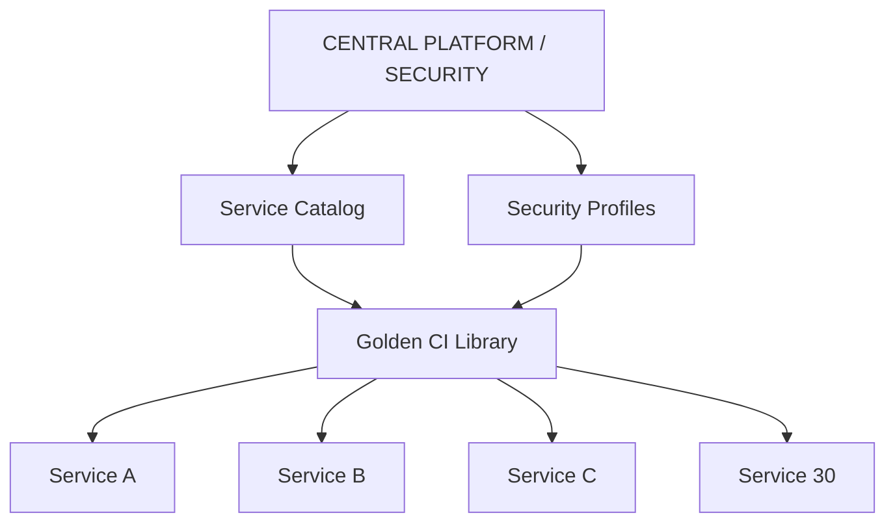
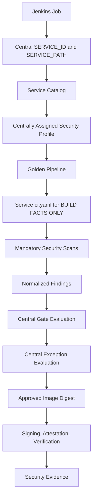
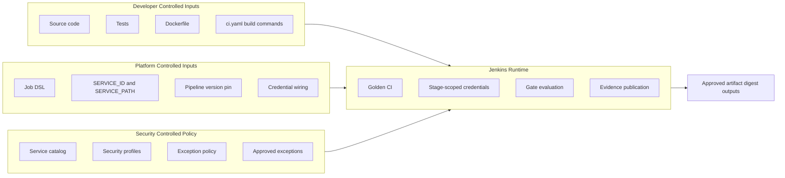

# Centralized Golden CI and Security Policy Reference Architecture

This implementation demonstrates one centrally governed CI pipeline with centralized security policy, centrally assigned service profiles, controlled finding-specific exceptions, and reproducible security evidence for a microservice portfolio.

The demonstration includes five small Maven/Java services and is designed to scale to approximately 30 services without cloning security logic across service pipelines.

## Table of Contents

1. Architecture Intent
2. The Problem
3. Design Principles
4. Repository Layout
5. End-to-End CI Flow
6. Trust Boundary and Ownership Model
7. Security Profile Model
8. Central Service Catalog
9. Trusted Service Identity
10. Service Configuration
11. Policy Resolution
12. Scanner and Policy-Evaluation Separation
13. Exception Management
14. Active Stage Navigator
15. Stage-by-Stage Design
16. Security Gate Summary
17. Credential Isolation
18. Artifact Signing and Provenance
19. Evidence Model
20. Scaling to 30 Services
21. Adding a 31st Service
22. Adding a New Security Gate
23. Testing the Policy Engine
24. Jenkins Setup
25. Repository Map
26. Limitations
27. Future Roadmap

## 1) Architecture Intent

Deliver one reusable Golden CI implementation where service teams define build facts and central Platform/Security defines mandatory security controls and enforcement.

## 2) The Problem

When each service owns its own security pipeline, controls drift, bypasses appear, and evidence is inconsistent. The party being evaluated can weaken controls by changing local pipeline logic.

## 3) Design Principles

1. Service teams define how to build applications.
2. Platform/Security defines how security controls execute and enforce.
3. Trusted service identity is centrally injected and centrally validated.
4. Mandatory controls cannot be disabled from service repositories.
5. Scanner execution and policy enforcement are separate stages.
6. Exceptions are finding-specific, approved, bounded, and auditable.
7. Evidence includes policy version, pipeline version, and policy digest.

## 4) Repository Layout

- central-policy: authoritative policy source of truth
- jenkins-shared-library: Golden CI implementation
- jenkins: minimal Jenkinsfile, pod template, Job DSL, setup guide
- services: five sample buildable services
- tests: policy tests and fixtures
- docs: profile, exception, onboarding, trust guidance

## 5) End-to-End CI Flow





## 6) Trust Boundary and Ownership Model



Service team controls:
- source code
- tests
- Dockerfile
- build metadata

Service team does not control:
- security classification
- security thresholds
- mandatory security gates
- exception approval and TTL policy
- signing and attestation requirements
- scanner failure policy
- trusted service identity mapping

Platform/Security controls:
- Golden Shared Library
- central policy files
- Job DSL identity mapping
- credential setup
- policy/pipeline rollout

## 7) Security Profile Model

Exactly three profiles are implemented: baseline, standard, critical.

| Control | Baseline | Standard | Critical |
|---|---|---|---|
| Secret scan | Block | Block | Block |
| Unit tests | Block | Block | Block |
| Coverage | 60% | 70% | 80% |
| SCA Critical | Block | Block | Block |
| SCA High | Warn | Block | Block |
| SAST execution | Required | Required | Required |
| Sonar Quality Gate | Block | Block | Strict Block |
| Container Critical | Block | Block | Block |
| Container High | Warn | Block | Block |
| SBOM | Required | Required | Required |
| Signing | Required | Required | Required |
| Attestation | Optional/Report | Required | Required |
| Provenance verification | Report | Required | Required |
| Maximum exception TTL | 90 days | 60 days | 30 days |
| Scanner execution error | Block | Block | Block |

These thresholds are reference defaults and should be adapted to organizational risk and compliance.

## 8) Central Service Catalog

service-catalog.yaml is authoritative and centrally assigns profile and owner for each service.

In real organizations, this file should be protected by CODEOWNERS and branch protection. This reference includes an inactive example at examples/CODEOWNERS.example.

## 9) Trusted Service Identity

Trusted service identity flow:

1. Jenkins Job DSL centrally injects SERVICE_ID and SERVICE_PATH.
2. Shared Library resolves service from central catalog.
3. Shared Library validates exact SERVICE_PATH match.
4. Shared Library loads profile from catalog only.
5. Missing/unknown/mismatched identity fails closed.

## 10) Service Configuration

Service ci.yaml allows build facts only.

Unsafe anti-pattern rejected:

```yaml
security:
  trivy: false
  sonar: false
```

Why rejected: the party whose code is being evaluated must not have unilateral control over mandatory security control execution.

Correct separation:

Service-owned build config:

```yaml
build:
  tool: maven
  javaVersion: 21
container:
  dockerfile: Dockerfile
```

Central profile assignment:

```yaml
services:
  payment-api:
    profile: critical
```

## 11) Policy Resolution

PolicyLoader loads:
- policy-metadata.yaml
- service-catalog.yaml
- security-profiles.yaml
- exceptions.yaml
- exception-policy.yaml
- service-config-schema.json

Policy digest is deterministic SHA-256 over effective policy inputs. Evidence records:
- pipelineVersion
- policyVersion
- policyDigest

Pipeline code and policy data can evolve independently.

## 12) Scanner and Policy-Evaluation Separation

Scan execution and gate evaluation are separate.

Flow:
- scanner runs
- report produced
- report parsed into normalized findings
- gate evaluator enforces profile rules
- exception evaluator applies exact approved exceptions
- final decision PASS/WARN/FAIL/EXCEPTION_APPLIED

Fail closed when scanner execution/report integrity is not trustworthy.

## 13) Exception Management

Active central exceptions file starts empty:
- exceptions: []

Exception requirements:
- finding-specific
- service-specific
- gate-specific
- owner, reason, ticket, approval, approvedAt, expiresAt required
- no wildcard values
- expiresAt must be after approvedAt
- TTL validated against profile max
- forbidden gates cannot be excepted
- expired exceptions are invalid and reported
- unused exceptions are reported

## 14) Active Stage Navigator

1. Checkout
2. Load Central Policy
3. Resolve Trusted Service Identity
4. Validate Service Configuration
5. Repository Secret Scan
6. Secret Exposure Gate
7. Unit Test Execution
8. Unit Test Result Gate
9. Coverage Evidence
10. Coverage Policy Gate
11. SCA Dependency Scan
12. SCA Policy Gate
13. SAST / SonarQube Analysis
14. SonarQube Quality Gate
15. Build Application
16. Build Docker Image
17. Generate CycloneDX SBOM
18. Container Vulnerability Scan
19. Container Security Policy Gate
20. Dependency-Track Publication
21. Archive Security Evidence
22. Push Approved Image
23. Resolve Image Digest
24. Sign Image Digest
25. Create Attestations
26. Verify Provenance
27. Publish Final Evidence Summary

## 15) Stage-by-Stage Design

Each stage is intentionally split between execution and enforcement where practical.

Examples:
- Secret scan execution then explicit secret gate.
- Unit-test run then explicit test gate.
- Scanner execution then scanner health gate and finding gate.

## 16) Security Gate Summary

GateDecision model exposes:
- service
- profile
- gate
- criticalFindings
- highFindings
- appliedExceptions
- blockingFindings
- decision
- reason

Decision values:
- PASS
- WARN
- FAIL
- EXCEPTION_APPLIED

## 17) Credential Isolation

Credentials are stage-scoped in Jenkins installation guidance.

Build and test stages do not receive:
- registry credentials
- cosign credentials
- dependency-track credentials

## 18) Artifact Signing and Provenance

Only approved artifacts are pushed.

Security identity uses immutable digest references:
- registry.example.com/service@sha256:...

Signing and attestation are bound to digest, not mutable tags.

## 19) Evidence Model

EvidencePublisher produces machine-readable JSON and a concise human summary with:
- service identity and owner
- assigned profile
- pipeline version, policy version, policy digest
- coverage and gate decisions
- applied and unused exceptions
- SBOM path and digest
- image reference and digest
- signature, attestation, provenance verification results

## 20) Scaling to 30 Services

Scaling pattern:

30 services
-> 30 small build-only ci.yaml files
-> 1 Golden Shared Library
-> 1 central service catalog
-> 3 profiles
-> 1 controlled exception model

We do not create 30 security pipelines.

## 21) Adding a 31st Service

1. Create service source/tests/Dockerfile/ci.yaml.
2. Platform adds service entry to service-catalog.yaml.
3. Security assigns profile.
4. Platform adds centrally managed Job DSL mapping.
5. Jenkins injects SERVICE_ID and SERVICE_PATH.
6. Golden CI enforces mandatory controls automatically.
7. Evidence records policy and immutable digest.

## 22) Adding a New Security Gate

Example: central license scanning gate.

Platform/Security updates:
- Shared Library stage and evaluator
- profile policy
- validator checks
- fixtures and tests
- docs
- version metadata as needed

Service teams do not modify service-level security pipeline logic.

## 23) Testing the Policy Engine

Run:

- cd centralized-ci-policy-ref/tests/policy-engine
- mvn test

The suite includes coverage, service identity, configuration rejection, scanner failure, exception validity, TTL, wildcard rejection, and profile-resolution scenarios.

## 24) Jenkins Setup

See jenkins/installation.md.

Jenkinsfile entrypoint is intentionally minimal:

- @Library('company-golden-ci@v1.0.0') _
- goldenCI()

## 25) Repository Map

- architecture/README.md
- central-policy/*
- jenkins-shared-library/*
- jenkins/*
- services/*
- tests/*
- docs/*
- examples/CODEOWNERS.example

## 26) Limitations

1. Demonstration scanner stages use fixtures in this repository to keep the reference runnable without external infrastructure.
2. Real SonarQube, Trivy, Dependency-Track, and Cosign runtime integrations require live infrastructure.
3. Pod template uses Docker socket for demonstration; production should prefer hardened image-build approaches.
4. Maven wrapper is not included per service; Maven 3.9+ and Java 21 are required locally.

## 27) Future Roadmap

1. Add real scanner adapters and richer parser validation for production reports.
2. Add optional scheduled stale-exception reporting.
3. Add Gradle/npm/go build support in BuildExecutor.
4. Add policy packaging consistency tests if embedded resources are introduced.
5. Add pipeline upgrade rollout automation and compatibility test matrix.

## Useful Quick Links

- architecture/README.md
- docs/security-profiles.md
- docs/exception-management.md
- docs/onboarding-new-service.md
- docs/adding-security-control.md
- docs/trust-boundaries.md
- jenkins/installation.md
- jenkins-shared-library/README.md
