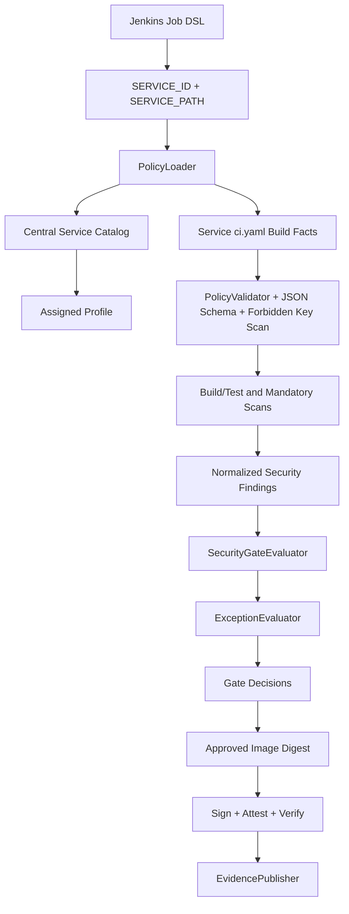

# Architecture Details

This reference architecture demonstrates a single reusable Golden CI implementation with centralized policy control and centrally assigned security profiles for many services.

## Components

1. Central policy source of truth: centralized-ci-policy-ref/central-policy
2. Golden CI Shared Library implementation: centralized-ci-policy-ref/jenkins-shared-library
3. Jenkins central entrypoint and job provisioning: centralized-ci-policy-ref/jenkins
4. Service build metadata and source: centralized-ci-policy-ref/services
5. Policy tests and fixtures: centralized-ci-policy-ref/tests
6. Operational guidance: centralized-ci-policy-ref/docs

## Control Flow

## Trust Boundaries

Platform/Security trusted inputs:
- central-policy/service-catalog.yaml
- central-policy/security-profiles.yaml
- central-policy/exception-policy.yaml
- central-policy/exceptions.yaml
- jenkins/job-dsl.groovy

Developer-controlled untrusted inputs:
- services/* source code
- services/* tests
- services/* Dockerfile
- services/* ci.yaml build commands

Jenkins-controlled identity:
- SERVICE_ID and SERVICE_PATH are injected centrally and validated against the catalog.

## Policy and Pipeline Version Independence

- pipeline version: policy-metadata.yaml -> pipeline.version
- policy version: policy-metadata.yaml -> policy.version
- policy digest: computed from the effective policy files and written to evidence

Pipeline code and policy data can evolve independently.
