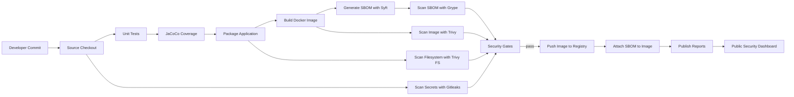

# Supply Chain Security Reference Architecture

Reference architectures for teaching engineers how to design, implement, validate, and operate secure software delivery pipelines.

[](https://htmlpreview.github.io/?https://github.com/Github-Arun-Repo/platform-engineering-reference-architectures/blob/main/docs/security-reports/index.html)

> This section is not only about CI/CD tooling. It is about the **software supply chain** around container delivery: source control, build isolation, unit testing, code coverage, image creation, SBOM generation, vulnerability scanning, secret detection, artifact traceability, registry publishing, and evidence reporting.

## Contents

1. [What This Section Teaches](#what-this-section-teaches)
2. [Documentation Model](#documentation-model)
3. [Reference Architecture Scope](#reference-architecture-scope)
4. [Architecture Diagram](#architecture-diagram)
5. [Current Security and Quality Chain](#current-security-and-quality-chain)
6. [Design Principles](#design-principles)
7. [Folder Map](#folder-map)
8. [Learning Paths](#learning-paths)
9. [Implemented Patterns](#implemented-patterns)
10. [Supply Chain Controls Included](#supply-chain-controls-included)
11. [Evidence and Reports](#evidence-and-reports)
12. [Reference Implementations](#reference-implementations)
13. [Sample Application](#sample-application)
14. [Runbooks vs Architecture Guides](#runbooks-vs-architecture-guides)
15. [Roadmap](#roadmap)

## What This Section Teaches

This section is designed to help engineers answer questions such as:

- How should a secure image build pipeline be structured?
- What should run before an image is pushed to a registry?
- Where should unit tests, code coverage, SBOM generation, and vulnerability gates sit?
- How do you turn a pipeline into a reusable reference architecture instead of a one-off job?
- How do you expose audit evidence so other engineers can inspect pipeline outputs without Jenkins access?

The goal is to teach **architecture and design decisions**, not only commands.

## Documentation Model

This part of the repository intentionally separates two types of documentation.

**Architecture README**

- Explains the target design
- Describes the control flow and reasoning
- Shows diagrams, phases, and trade-offs
- Helps engineers learn how to design similar pipelines

**Runbook**

- Focuses on execution of a specific job or demo
- Covers installation prerequisites, pre-flight, job triggering, operational checks, and troubleshooting
- Should stay procedural and hands-on

That separation is different from the Argo CD area because the main value here is the **supply chain design**, while the runbook should stay limited to **pipeline job execution and operations**.

## Reference Architecture Scope

This CI/CD area currently focuses on **Phase 1: secure image build pipelines**.

That means the current reference architecture covers:

- source checkout
- unit testing
- JaCoCo code coverage
- application packaging
- container image build
- SBOM generation with Syft
- SBOM vulnerability analysis with Grype
- image vulnerability scanning with Trivy
- filesystem scanning with Trivy FS
- secret scanning with Gitleaks
- registry push
- evidence publication to a public dashboard

Future phases will extend this into deployment promotion, GitOps integration, provenance, signing, and policy enforcement.

## Architecture Diagram



## Current Security and Quality Chain

The current Jenkins reference implementation follows this order:

```text
Checkout
→ Unit Tests
→ JaCoCo Coverage
→ Package Application
→ Build Docker Image
→ Generate SBOM
→ Grype SBOM Scan
→ Trivy Image Scan
→ Trivy Filesystem Scan
→ Gitleaks Secret Scan
→ Security Gates
→ Push to Registry
→ Attach SBOM
→ Publish Reports
```

The sequence is intentional.

- Cheap failures happen early.
- Security evidence is produced before the image is promoted.
- The registry receives artifacts only after required gates pass.
- Reports are published so engineers can review the evidence outside Jenkins.

## Design Principles

This reference architecture is built around the following principles.

**Design for traceability**

- Every build should produce evidence.
- A build number should map to image tags, reports, and source code.

**Fail fast on code and policy**

- Tests and required security gates should stop promotion quickly.
- Expensive or downstream actions should not run after known failures.

**Separate evidence generation from job UI access**

- Engineers should be able to inspect supply chain outputs without logging into Jenkins.

**Prefer layered controls**

- One scanner is not enough.
- SBOM analysis, image scanning, filesystem scanning, and secret scanning answer different questions.

**Keep the pipeline teachable**

- Each control should have a visible purpose.
- Stages should map to engineering decisions, not only tool invocations.

## Folder Map

```text
cicd-reference-architectures/
├── README.md
├── sample-application/
├── phase-1-image-build-jenkins/
│   ├── Jenkinsfile
│   ├── README.md
│   ├── installation-jenkins.md
│   └── jenkins-demo-runbook.md
├── phase-1-image-build-github-actions/
└── ../docs/security-reports/
```

What each area is for:

- `README.md`: main teaching guide for supply chain pipeline design
- `sample-application/`: minimal Spring Boot app used as the workload under test
- `phase-1-image-build-jenkins/`: Jenkins implementation and operational runbook
- `phase-1-image-build-github-actions/`: GitHub Actions implementation of the same phase
- `docs/security-reports/`: published evidence and dashboard output

## Learning Paths

Choose the entry point based on what you want to learn.

**I want the architectural overview first**

- Continue reading this README

**I want the Jenkins implementation**

- [phase-1-image-build-jenkins](./phase-1-image-build-jenkins/)

**I want the Jenkins job execution runbook**

- [jenkins-demo-runbook.md](./phase-1-image-build-jenkins/jenkins-demo-runbook.md)

**I want the GitHub Actions implementation**

- [phase-1-image-build-github-actions](./phase-1-image-build-github-actions/)

**I want to inspect the sample workload**

- [sample-application](./sample-application/)

**I want to inspect the published evidence**

- [Security Reports Dashboard](https://htmlpreview.github.io/?https://github.com/Github-Arun-Repo/platform-engineering-reference-architectures/blob/main/docs/security-reports/index.html)

## Implemented Patterns

### Pattern 1: Secure Image Build Pipeline

This is the active pattern implemented today.

It teaches how to:

- test the code before artifact promotion
- generate coverage evidence with JaCoCo
- build a container image from a Java application
- create an SBOM in CycloneDX and SPDX formats
- gate the build on SBOM vulnerability findings
- scan the final image and the application filesystem
- detect committed secrets
- publish reports for engineering review

### Pattern 2: Public Evidence Publication

The pipeline commits report outputs into `docs/security-reports/` and exposes them through a static dashboard.

That teaches an important operating model:

- Jenkins is the execution engine
- Git is the evidence store
- the dashboard is the engineer-facing review surface

## Supply Chain Controls Included

| Control | Tool | Purpose | Current Behavior |
|---|---|---|---|
| Unit tests | Maven Surefire + JUnit | Validate application behavior | Blocking |
| Code coverage | JaCoCo | Provide test coverage evidence | Reported |
| Image SBOM | Syft | Produce package inventory | Reported |
| SBOM vulnerability scan | Grype | Analyze SBOM for known vulnerabilities | Gated by severity |
| Image scan | Trivy image | Scan final container image | Reported |
| Filesystem scan | Trivy fs | Scan source/build context and dependencies | Reported |
| Secret scan | Gitleaks | Detect committed secrets | Blocking |
| Registry publication | Docker push | Promote approved image | Runs after gates |
| OCI attachment | ORAS | Attach CycloneDX SBOM to image | Best effort |

## Evidence and Reports

The reference implementation publishes the following evidence.

- Trivy image report
- Trivy filesystem report
- Gitleaks secret report
- Syft SBOM report
- Grype SBOM vulnerability report
- JaCoCo coverage report
- build metadata for dashboard freshness

Public report entry point:

- [Security Reports Dashboard](https://htmlpreview.github.io/?https://github.com/Github-Arun-Repo/platform-engineering-reference-architectures/blob/main/docs/security-reports/index.html)

This lets engineers review:

- what was scanned
- what passed or failed
- what the package inventory looks like
- what vulnerability evidence was produced
- what the unit test coverage report looks like

## Reference Implementations

### Jenkins

Use Jenkins when you want:

- self-hosted execution
- Kubernetes agents
- strong control over runtime environment
- enterprise plugin ecosystem
- custom orchestration around build, scan, push, and reporting

Start here:

- [Jenkins implementation](./phase-1-image-build-jenkins/)
- [Jenkins runbook](./phase-1-image-build-jenkins/jenkins-demo-runbook.md)

### GitHub Actions

Use GitHub Actions when you want:

- lower setup overhead
- native GitHub integration
- managed runners
- workflow execution close to source control

Start here:

- [GitHub Actions implementation](./phase-1-image-build-github-actions/)

## Sample Application

The sample workload is intentionally simple so the focus stays on pipeline design.

- Java 21
- Spring Boot 3.2
- Spring Web + Spring Data JPA
- H2 in-memory database
- REST endpoints for a TODO API

It is not the product being taught.

The product being taught is the **secure delivery architecture around it**.

## Runbooks vs Architecture Guides

This section should be read with the following rule.

**Read the main README when you want to understand the architecture.**

- Why the stages exist
- Why the controls are ordered this way
- What evidence is generated
- How to think about a software supply chain

**Read the runbook when you want to execute or operate a specific pipeline job.**

- Install Jenkins
- create credentials
- trigger the job
- inspect console output
- walk through failure scenarios
- recover from operational issues

That distinction is important because architecture learning and job execution are different engineering tasks.

## Roadmap

Planned extensions for this reference architecture:

1. provenance and artifact signing
2. GitOps manifest update and deployment promotion
3. multi-environment release workflows
4. policy-as-code enforcement
5. license compliance reporting
6. admission control integration
7. additional CI implementations beyond Jenkins and GitHub Actions

## Recommended Reading Order

1. Read this README to understand the design.
2. Review the Jenkins or GitHub Actions implementation.
3. Run the Jenkins runbook for hands-on execution.
4. Inspect the public dashboard and reports.
5. Adapt the architecture to your own registry, runners, and policies.

### Audit and Compliance

Log and audit all builds:
- Every build is logged and traceable
- Link artifacts to commits (image tag includes commit SHA)
- Track who triggered builds
- Store artifacts with retention policy

---

## Learning Path

1. **Understand the principles** — Read sections above
2. **Choose a tool** — Jenkins or GitHub Actions (or both)
3. **Review the implementation** — Read phase-1 README
4. **Explore the code** — Examine Jenkinsfile or workflow YAML
5. **Inspect the Dockerfile** — Understand multi-stage build
6. **Run locally** — Build the sample app locally with Docker
7. **Configure your tool** — Set up Jenkins or GitHub Actions in your environment
8. **Execute the pipeline** — Trigger a build and watch stages execute
9. **Inspect the image** — Run `docker inspect` on the built image
10. **Understand the output** — Review build logs, scan reports, artifact registry

---

## Production Readiness Checklist

Before deploying pipelines to your team:

- [ ] Container registry is private and access-controlled
- [ ] Image scanning (Trivy or similar) is mandatory, not optional
- [ ] Build logs are retained (audit trail)
- [ ] Failed builds alert the team (Slack, email)
- [ ] Artifacts are versioned with commit SHA for traceability
- [ ] Secrets are stored in vault, not in code or logs
- [ ] Registry credentials are rotated regularly
- [ ] Image pull secrets are created in Kubernetes
- [ ] Docker daemon limits are set (memory, CPU)
- [ ] Build timeouts prevent runaway jobs
- [ ] SBOM is generated for every image
- [ ] Backup strategy exists for artifact registry

---

## Key Takeaways

1. **CI/CD automates the path from code to running container** — commit → build → test → scan → push → deploy

2. **Container images are the unit of deployment** — not source code, not configuration

3. **Fail fast** — expensive operations (pushing to registry) come last; cheap operations (running tests) come first

4. **Supply chain security is non-negotiable** — scan for CVEs, generate SBOM, verify artifacts

5. **Different tools for different contexts** — GitHub Actions for GitHub users, Jenkins for complex workflows, Tekton for Kubernetes-first

6. **Build once, deploy many times** — the same image artifact runs in dev, staging, and production

7. **Traceability matters** — every artifact linked to a commit, every deployment logged

---

## Related Documentation

- [ArgoCD and GitOps Reference Architecture](../argocd-reference-architectures/) — Deployment patterns
- [Terraform Infrastructure](../terraform/) — Infrastructure as code
- [Main Repository README](../README.md)

---

## Phases Overview

| Phase | Focus | Status |
|-------|-------|--------|
| **Phase 1** | Image Build & Push | ✅ Complete (Jenkins + GitHub Actions) |
| **Phase 2** | ArgoCD Integration | 🔄 Planned |
| **Phase 3** | Multi-Environment | 🔄 Planned |
| **Phase 4** | Blue-Green Deployments | 🔄 Planned |
| **Phase 5** | Canary & Traffic Management | 🔄 Planned |

More phases to be added as the reference architecture grows.

---

## Contributing & Questions

These patterns are designed to be **reference implementations**, not copy-paste templates. Adapt them to your organization's needs, constraints, and preferences.

Questions? Explore the phase-specific READMEs for detailed guidance.
