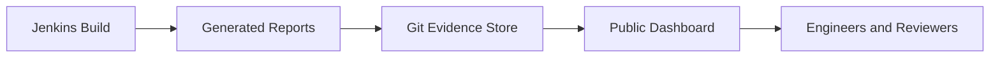

# Supply Chain Security Reference Architecture

This reference architecture shows how to design a secure container delivery pipeline from source code to registry publication, with security evidence generated at every important control point.

This architecture is build-tool agnostic. You can implement the same control flow with tools such as Jenkins, GitHub Actions, GitLab CI, Tekton, or Azure DevOps. In this repository, the implemented reference uses Jenkins. GitHub Actions is also a modern and widely used approach for teams that prefer GitHub-native CI.

[](https://htmlpreview.github.io/?https://github.com/Github-Arun-Repo/platform-engineering-reference-architectures/blob/main/docs/security-reports/index.html)

## Start Here: Verified Report Evidence

Executed and validated by **Arunasalam Govindasamy** against the sample Spring Boot TODO application in this repository, with full report outputs published for public review.

- [Open Security Reports Dashboard](https://htmlpreview.github.io/?https://github.com/Github-Arun-Repo/platform-engineering-reference-architectures/blob/main/docs/security-reports/index.html)
- Application under test: [sample-application](./sample-application/)
- Full security report files: [security-reports](../security-reports/)

What this implementation demonstrates with generated evidence:

- unit test execution and code coverage outputs
- SonarQube analysis with a required quality-gate placeholder step
- optional OWASP Dependency-Check placeholder stage (toggle-driven)
- filesystem and container vulnerability scan results
- Trivy-based CycloneDX SBOM generation
- Trivy severity gating before promotion (Critical fail, High configurable, Medium report-only)
- dependency intelligence publication to Dependency-Track after security gates
- secret scanning results from repository content
- registry push controls, signing, attestation, and SBOM attachment evidence
- report publication to Git so teams can review without Jenkins access

## Contents

1. [Architecture Intent](#architecture-intent)
2. [End-to-End Supply Chain](#end-to-end-supply-chain)
3. [Evidence Model](#evidence-model)
4. [Stage Navigator](#stage-navigator)
5. [1. Source and Checkout](#1-source-and-checkout)
6. [2. Scan Secrets](#2-scan-secrets)
7. [3. Scan Filesystem](#3-scan-filesystem)
8. [4. Unit Tests](#4-unit-tests)
9. [5. Code Coverage](#5-code-coverage)
10. [6. SAST and Code Quality](#6-sast-and-code-quality)
11. [7. Package Application](#7-package-application)
12. [8. Build Container Image](#8-build-container-image)
13. [9. Generate CycloneDX SBOM](#9-generate-cyclonedx-sbom)
14. [10. Scan Container Image](#10-scan-container-image)
15. [11. Evaluate Security Gates](#11-evaluate-security-gates)
16. [12. Publish SBOM to Dependency-Track](#12-publish-sbom-to-dependency-track)
17. [13. Archive Security Reports](#13-archive-security-reports)
18. [14. Publish Report Evidence](#14-publish-report-evidence)
19. [15. Push to Registry](#15-push-to-registry)
20. [16. Deploy with ArgoCD](#16-deploy-with-argocd)
21. [17. Sign Image](#17-sign-image)
22. [18. Attest Image](#18-attest-image)
23. [19. Attach SBOM](#19-attach-sbom)
24. [20. Publish Cosign Evidence](#20-publish-cosign-evidence)
25. [Reference Implementations](#reference-implementations)
26. [Runbooks vs Reference Guides](#runbooks-vs-reference-guides)
27. [Roadmap](#roadmap)

## Architecture Intent

This reference is for engineers designing secure build pipelines for containerized workloads.

It provides a reusable pattern for answering four architectural questions:

1. **What checks must happen before an image is promoted?**
2. **What evidence should be generated for each build?**
3. **Which findings should block delivery, and which should be reported?**
4. **How can teams inspect supply chain security output without depending on Jenkins UI access?**

The sample application is intentionally small. The important part is the supply chain around it.

## End-to-End Supply Chain

The architecture is designed as a chain of evidence. Each step either validates the artifact, enriches it with metadata, or decides whether it is allowed to move forward.


```mermaid
flowchart LR
    commit[01<br/>Developer Commit]
    checkout[02<br/>Checkout]
    gitleaks[03<br/>Secret Scan]
    trivyFs[04<br/>Filesystem Scan]
    tests[05<br/>Unit Tests]
    coverage[06<br/>Coverage]
    sonar[07<br/>SonarQube]
    sonarGate[08<br/>SonarQube Quality Gate<br/>Placeholder Required Step]
    owasp[09<br/>OWASP Dependency-Check<br/>Optional Placeholder]
    package[10<br/>Package App]
    image[11<br/>Build Image]
    sbom[12<br/>Trivy CycloneDX SBOM]
    trivyImage[13<br/>Trivy Image Scan]
    gates[14<br/>Security Gates]
    dtrack[15<br/>Dependency-Track Upload]
    archive[16<br/>Archive Reports]
    reportCommit[17<br/>Publish Report Evidence]
    registry[18<br/>Registry Push]
    deploy[19<br/>Deploy with ArgoCD]
    sign["20<br/>Cosign Sign (Default On)"]
    attest["21<br/>Cosign Attest (Default On)"]
    attach[22<br/>Attach SBOM]
    cosignCommit[23<br/>Publish Cosign Evidence]
    evidence[24<br/>Evidence Dashboard]

    commit --> checkout --> gitleaks --> trivyFs --> tests --> coverage --> sonar --> sonarGate --> owasp --> package --> image --> sbom --> trivyImage --> gates --> dtrack --> archive --> reportCommit --> registry --> sign --> attest --> attach --> cosignCommit --> deploy --> evidence
    gitleaks --> gates
    trivyFs --> gates
    trivyImage --> gates
    gitleaks --> reportCommit
    trivyFs --> reportCommit
    trivyImage --> reportCommit
    reportCommit --> evidence
    cosignCommit --> evidence

    classDef source fill:#e7f0ff,stroke:#1f6feb,color:#0b1f44,stroke-width:1px;
    classDef quality fill:#ecfdf3,stroke:#1a7f37,color:#062b16,stroke-width:1px;
    classDef artifact fill:#fff8c5,stroke:#9a6700,color:#3b2300,stroke-width:1px;
    classDef security fill:#ffebe9,stroke:#cf222e,color:#4d1113,stroke-width:1px;
    classDef publish fill:#f6f8fa,stroke:#57606a,color:#24292f,stroke-width:1px;

    class commit,checkout source;
    class tests,coverage,sonar,sonarGate quality;
    class package,image,sbom,dtrack,archive artifact;
    class trivyImage,trivyFs,gitleaks,gates,owasp,sign,attest security;
    class registry,reportCommit,attach,cosignCommit,deploy,evidence publish;
```

This is the core chain: code enters, controls run one after another, evidence is produced, and only approved artifacts move forward.

## Evidence Model


```mermaid
flowchart LR
    build[Jenkins Build]
    reports[Generated Reports]
    git[Git Evidence Store]
    dashboard[Public Dashboard]
    engineers[Engineers and Reviewers]

    build --> reports
    reports --> git
    git --> dashboard
    dashboard --> engineers
```

Jenkins executes the pipeline. Git stores the published evidence. The dashboard provides the review surface.

Current dashboard:

- [Security Reports Dashboard](https://htmlpreview.github.io/?https://github.com/Github-Arun-Repo/platform-engineering-reference-architectures/blob/main/docs/security-reports/index.html)

## Stage Navigator

Click any stage to inspect what it does, why it exists, and where it is useful.

| Order | Stage | Tool | Used For | Gate |
|---:|---|---|---|---|
| 1 | [Source and Checkout](#1-source-and-checkout) | Git + Jenkins SCM | traceable source input | yes, if checkout fails |
| 2 | [Scan Secrets](#2-scan-secrets) | Gitleaks | committed secret detection | yes |
| 3 | [Scan Filesystem](#3-scan-filesystem) | Trivy fs | source/build context scan | reported |
| 4 | [Unit Tests](#4-unit-tests) | Maven Surefire + JUnit | behavior validation | yes |
| 5 | [Code Coverage](#5-code-coverage) | JaCoCo | coverage evidence | reported |
| 6 | [SAST and Code Quality](#6-sast-and-code-quality) | SonarQube | source-level security and maintainability | yes |
| 6a | [SAST and Code Quality](#6-sast-and-code-quality) | SonarQube `waitForQualityGate` | required quality gate placeholder step | placeholder |
| 6b | [SAST and Code Quality](#6-sast-and-code-quality) | OWASP Dependency-Check | optional placeholder pre-image check | optional (default off) |
| 7 | [Package Application](#7-package-application) | Maven | build JAR artifact | yes |
| 8 | [Build Container Image](#8-build-container-image) | Docker | immutable runtime artifact | yes |
| 9 | [Generate CycloneDX SBOM](#9-generate-cyclonedx-sbom) | Trivy | CycloneDX package inventory for reuse | reported |
| 10 | [Scan Container Image](#10-scan-container-image) | Trivy image | image layer dependency CVEs | severity gated |
| 11 | [Evaluate Security Gates](#11-evaluate-security-gates) | Jenkins policy logic | policy enforcement before publication/push | yes |
| 12 | [Publish SBOM to Dependency-Track](#12-publish-sbom-to-dependency-track) | OWASP Dependency-Track | SBOM publication after gates | best effort |
| 13 | [Archive Security Reports](#13-archive-security-reports) | Jenkins artifacts | audit and evidence retention | reported |
| 14 | [Publish Report Evidence](#14-publish-report-evidence) | Jenkins + Git + HTML | public report publication after gating and post-gate uploads | reported |
| 15 | [Push to Registry](#15-push-to-registry) | Docker | artifact promotion | yes |
| 16 | [Deploy with ArgoCD](#16-deploy-with-argocd) | Jenkins deployment handoff | deployment update after security controls | yes |
| 17 | [Sign Image](#17-sign-image) | Cosign | digest integrity proof | yes (default on) |
| 18 | [Attest Image](#18-attest-image) | Cosign | SBOM and build evidence referrers | yes (default on) |
| 19 | [Attach SBOM](#19-attach-sbom) | ORAS | OCI artifact attachment | best effort |
| 20 | [Publish Cosign Evidence](#20-publish-cosign-evidence) | Jenkins + Git + HTML | public signing and attestation evidence | yes (default on) |

## 1. Source and Checkout

**What happens**

Jenkins checks out the repository and pins the pipeline to a specific source revision.

**Why this matters**

Every downstream artifact must be traceable to source code. Without a clean source checkpoint, SBOMs, images, scan reports, and coverage output lose their audit value.

**Where this is useful**

- regulated build pipelines
- incident investigation
- artifact provenance
- rollback analysis

**Reference implementation**

- [Jenkinsfile](./supply-chain-security-jenkins/Jenkinsfile)

## 2. Scan Secrets

**What happens**

Gitleaks scans the repository immediately after checkout for hardcoded credentials, keys, and tokens.

**Why this matters**

Secrets in source control are high-risk findings and should fail the build before the pipeline spends time compiling, packaging, or creating images.

Current behavior in Jenkins: Gitleaks fails immediately in the secret scan stage when findings or scan errors are detected.

**Where this is useful**

- repository protection
- early fail-fast validation
- credential hygiene
- audit evidence for secret scanning

**Evidence produced**

- [Gitleaks Secret Report](https://htmlpreview.github.io/?https://github.com/Github-Arun-Repo/platform-engineering-reference-architectures/blob/main/docs/security-reports/gitleaks-report.html)

## 3. Scan Filesystem

**What happens**

Trivy FS scans the application filesystem and build context before packaging or image creation.

**Why this matters**

This check is source-oriented, so it belongs early. Running it before image creation gives faster feedback on dependencies, misconfigurations, and embedded secrets without waiting for the container build.

**Where this is useful**

- quick dependency checks
- source and build-context inspection
- misconfiguration review
- early feedback before artifact creation

**Evidence produced**

- [Trivy Filesystem Report](https://htmlpreview.github.io/?https://github.com/Github-Arun-Repo/platform-engineering-reference-architectures/blob/main/docs/security-reports/trivy-fs-report.html)

## 4. Unit Tests

**What happens**

Maven Surefire runs JUnit tests for the Spring Boot sample application.

**Why this matters**

Unit tests catch broken behavior before the pipeline spends time creating images, SBOMs, and registry artifacts. This is the first functional quality gate.

**Where this is useful**

- API validation
- regression protection
- pull request checks
- release candidate validation

**Evidence produced**

- Surefire XML test reports
- Jenkins JUnit test result view

## 5. Code Coverage

**What happens**

JaCoCo generates coverage evidence from the unit test run.

**Why this matters**

Coverage does not prove quality by itself, but it shows which code paths are exercised by tests. It is useful evidence when reviewing release readiness and test depth.

**Where this is useful**

- release reviews
- quality dashboards
- pull request standards
- future SonarQube quality gates

**Evidence produced**

- [JaCoCo Coverage Report](https://htmlpreview.github.io/?https://github.com/Github-Arun-Repo/platform-engineering-reference-architectures/blob/main/docs/security-reports/jacoco/index.html)

## 6. SAST and Code Quality

**What happens**

SonarQube analyzes source code, imports JaCoCo coverage, evaluates code quality and security rules, and can publish a quality gate decision back to Jenkins.

**Required placeholder step in this pipeline**

- SonarQube quality gate stage is explicitly present as a required placeholder step.
- The enforcement command is: `waitForQualityGate abortPipeline: true`.
- Current default behavior is placeholder mode (`ENABLE_SONARQUBE_QUALITY_GATE=false`) until teams enable hard enforcement.

**Optional placeholder before image build**

- OWASP Dependency-Check is positioned before image build as an optional placeholder stage.
- Toggle: `ENABLE_OWASP_DEPENDENCY_CHECK` (default `false`).

**Why this matters**

SAST belongs before package and image promotion because source-level vulnerabilities and maintainability issues should be reviewed before the pipeline creates deployable artifacts.

**Where this is useful**

- Java service quality gates
- SAST evidence before image promotion
- code coverage governance
- security hotspot review
- future pull request checks

**Tool reference**

- [SonarQube SAST](./tools/sonarqube-sast.md)

## 7. Package Application

**What happens**

Maven packages the Spring Boot application into an executable JAR.

**Why this matters**

The JAR is the application artifact copied into the container image. A packaging failure should stop the pipeline before container build.

**Where this is useful**

- Java service builds
- release artifact creation
- reproducible application packaging

## 8. Build Container Image

**What happens**

Docker builds the final runtime image and tags it with the Jenkins build number and `latest`.

**Why this matters**

The image is the deployable unit. It must be immutable, traceable, and tested before promotion.

**Where this is useful**

- Kubernetes deployments
- GitOps release flows
- container registry promotion
- environment parity across dev, staging, and production

## 9. Generate CycloneDX SBOM

**What happens**

Trivy scans the built image and generates a CycloneDX SBOM.

**Formats and outputs used**

- CycloneDX JSON: primary reusable SBOM artifact (`security-reports/sbom.cyclonedx.json`)
- Trivy SBOM log: generation diagnostics (`security-reports/sbom.trivy.log`)
- HTML summary: quick review (`security-reports/sbom-report.html`)

**Why this matters**

An SBOM answers: "What is inside this artifact?" It creates the package inventory needed for vulnerability analysis, incident response, and compliance review.

**Where this is useful**

- vulnerability management
- vendor reviews
- compliance evidence
- incident response when a new CVE is announced

**Evidence produced**

- [SBOM Report](https://htmlpreview.github.io/?https://github.com/Github-Arun-Repo/platform-engineering-reference-architectures/blob/main/docs/security-reports/sbom-report.html)

## 10. Scan Container Image

**What happens**

Trivy scans the built container image and generates JSON and HTML vulnerability reports.

**Why this matters**

This validates the deployable image artifact against known CVEs across runtime package layers.

**Where this is useful**

- dependency risk analysis
- build gates before registry push
- re-scanning historical artifacts
- CVE response workflows

**Evidence produced**

- [Trivy Image Report](https://htmlpreview.github.io/?https://github.com/Github-Arun-Repo/platform-engineering-reference-architectures/blob/main/docs/security-reports/trivy-report.html)

## 11. Evaluate Security Gates

**What happens**

Jenkins evaluates security gate inputs before promotion and before Dependency-Track publication.

**Why this matters**

Security reports are useful, but gates decide whether the artifact is allowed to continue in the supply chain.

**Security gate policy (implemented)**

| Control | Report/status checked | Fail condition | Warning condition | Pass condition |
|---|---|---|---|---|
| Gitleaks secrets gate | `security-reports/gitleaks-exit-code.txt` and `security-reports/gitleaks-report.json` | exit code `1` (findings) or `>1` (scan/runtime error) | none | exit code `0` |
| Trivy image vulnerability gate | `security-reports/trivy-scan-exit-code.txt`, `security-reports/trivy-critical-count.txt`, `security-reports/trivy-high-count.txt`, `security-reports/trivy-medium-count.txt` | Critical `> 0` always fails; High `> 0` fails only when `TRIVY_FAIL_ON_HIGH=true` | High findings when `TRIVY_FAIL_ON_HIGH=false`; Medium findings are report-only | scan status `0`, Critical `0`, and High policy satisfied |

**Current threshold configuration set (Jenkins environment)**

- `TRIVY_FAIL_ON_HIGH=false`
- `TRIVY_BLOCK_ON_SCAN_ERROR=true`

With current settings:

- any Gitleaks finding fails immediately in the secret scan stage
- any Trivy critical vulnerability fails in the security gate stage
- Trivy high vulnerabilities warn and continue by default
- Trivy medium vulnerabilities are report-only
- Trivy scan/tool errors fail by default

## 12. Publish SBOM to Dependency-Track

**What happens**

After security gates pass, Jenkins uploads the generated CycloneDX SBOM to Dependency-Track.

**Why this matters**

This keeps Dependency-Track publication aligned with promoted artifacts while preserving central SBOM history and vulnerability intelligence.

**Where this is useful**

- SBOM historical tracking
- long-lived vulnerability intelligence
- compliance evidence
- release review and audit trails

**Evidence produced**

- [Dependency-Track SBOM Publish Report](https://htmlpreview.github.io/?https://github.com/Github-Arun-Repo/platform-engineering-reference-architectures/blob/main/docs/security-reports/dependency-track-report.html)

## 13. Archive Security Reports

**What happens**

Jenkins archives all generated security JSON/HTML/TXT outputs as build artifacts.

**Why this matters**

This gives durable, build-bound security evidence for audits, automation, and release reviews.

**Where this is useful**

- release evidence retention
- compliance checks
- post-build automation
- incident response traceability

**Evidence produced**

- Jenkins build artifacts under `security-reports/*`

## 14. Publish Report Evidence

**What happens**

After security gating and post-gate SBOM publication, Jenkins commits the latest report artifacts back into the repository and updates the public dashboard content.

**Why this matters**

This makes the security evidence visible in Git and dashboard form so reviewers can inspect exact build outputs without requiring Jenkins access.

**Where this is useful**

- release review preparation
- audit-friendly evidence publication
- engineering demos and walkthroughs
- failure analysis when promotion is blocked

## 15. Push to Registry

**What happens**

The image is pushed to Docker Hub after required gates pass.

**Why this matters**

The registry should receive only artifacts that have passed the required quality and security checks.

**Where this is useful**

- Kubernetes deployments
- GitOps image promotion
- release candidate storage
- rollback to known-good images

**Follow-up controls**

After the image is pushed, the strongest next steps are to sign the immutable digest and attach attestations to it.

- [Cosign Signing](./tools/cosign-signing.md)

## 16. Deploy with ArgoCD

**What happens**

After security gates pass and artifacts are pushed, deployment handoff runs through the ArgoCD deployment stage.

**Why this matters**

This keeps deployment strictly downstream from security evaluation and artifact publication.

**Where this is useful**

- GitOps delivery handoff
- environment promotion workflows
- separation of build security and deployment operations

## 17. Sign Image

**What happens**

When Cosign is enabled, Jenkins signs the immutable pushed image digest after registry publication.

**Why this matters**

Signing proves integrity and gives downstream consumers a way to verify that the digest they are pulling is the one the pipeline intended to publish.

**Where this is useful**

- clear supply chain demonstrations
- cluster admission verification
- release provenance and trust establishment

**Tool reference**

- [Cosign Signing](./tools/cosign-signing.md)

## 18. Attest Image

**What happens**

When Cosign is enabled, Jenkins creates attestations for the CycloneDX SBOM and build metadata predicate.

**Why this matters**

Attestations carry evidence about the artifact, not just a proof that the artifact was signed. This is where package inventory and build context become verifiable OCI referrers.

**Where this is useful**

- SBOM-linked release evidence
- policy engines consuming predicates
- downstream supply chain verification

**Tool reference**

- [Cosign Signing](./tools/cosign-signing.md)

## 19. Attach SBOM

**What happens**

ORAS attempts to attach the CycloneDX SBOM to the pushed image as an OCI artifact.

**Why this matters**

Attaching evidence to the artifact keeps inventory close to the image it describes. This is useful for registries and platforms that understand OCI artifact relationships.

**Current behavior**

This step is best effort. If ORAS or the registry attachment fails, the SBOM remains available as Jenkins artifacts and public dashboard evidence.

## 20. Publish Cosign Evidence

**What happens**

When Cosign is enabled, Jenkins publishes signing, verification, attestation, and referrer evidence into `docs/security-reports/` and exposes it through the same public dashboard.

**Why this matters**

Signing only helps if others can inspect and verify it. Publishing the evidence makes the signature flow visible and reviewable for other engineers.

**Where this is useful**

- architecture reviews
- release reviews
- audit preparation
- team enablement
- security exception discussions

**Evidence entry point**

- [Security Reports Dashboard](https://htmlpreview.github.io/?https://github.com/Github-Arun-Repo/platform-engineering-reference-architectures/blob/main/docs/security-reports/index.html)

## Reference Implementations

### Jenkins (Chosen in this Repository)

Use this reference when you need:

- self-hosted execution
- Kubernetes-based build agents
- Jenkins credentials integration
- detailed stage-level operational visibility
- custom report publication back into Git

Files:

- [Jenkins reference](./supply-chain-security-jenkins/)
- [Jenkinsfile](./supply-chain-security-jenkins/Jenkinsfile)
- [Jenkins and SonarQube installation](./supply-chain-security-jenkins/installation-jenkins.md)
- [Jenkins runbook](./supply-chain-security-jenkins/jenkins-demo-runbook.md)

## Runbooks vs Reference Guides

Use this README for architecture reference.

Use the runbook for job execution.

| Document | Purpose |
|---|---|
| Main README | Architecture, control placement, diagrams, evidence model |
| Jenkins runbook | Installation checks, job execution, console inspection, troubleshooting |
| Sample app README | Application-specific context |

## Repository Map

```text
cicd-reference-architectures/
├── README.md
├── sample-application/
├── supply-chain-security-jenkins/
│   ├── Jenkinsfile
│   ├── installation-jenkins.md
│   └── jenkins-demo-runbook.md
└── ../docs/security-reports/
```

## Roadmap

Planned additions:

1. admission-time verification of signatures and attestations
2. policy-based promotion using signed evidence
3. GitOps manifest update
4. environment promotion strategy
5. policy-as-code gates
6. license compliance reporting
7. admission controller integration
8. registry-native evidence discovery

## Quick Links

- [Security Reports Dashboard](https://htmlpreview.github.io/?https://github.com/Github-Arun-Repo/platform-engineering-reference-architectures/blob/main/docs/security-reports/index.html)
- [Tools Reference](./tools/README.md)
- [Cosign Signing Reference](./tools/cosign-signing.md)
- [SonarQube SAST Reference](./tools/sonarqube-sast.md)
- [Jenkins Reference](./supply-chain-security-jenkins/)
- [Jenkins Runbook](./supply-chain-security-jenkins/jenkins-demo-runbook.md)
- [Sample Application](./sample-application/)
- [Main Repository README](../README.md)