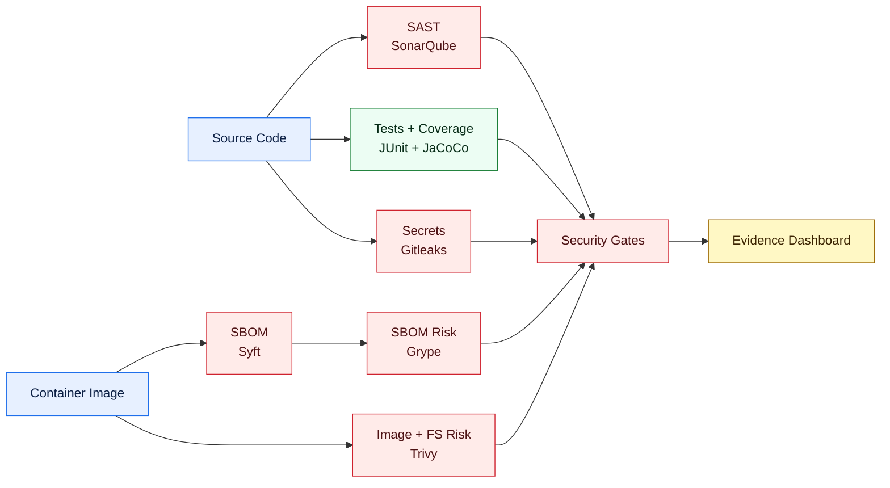

# Supply Chain Security Tools Reference

This section explains the tools behind the supply chain security reference architecture: what each tool is used for, why it is selected, what alternatives exist, and when a licensed option is worth choosing.

The main pipeline README explains the process. These pages explain the tool choices.

## Tool Map

## Tool Decision Index

| Security area | Chosen tool | Detail page | Why this is used here |
|---|---|---|---|
| SAST and code quality | SonarQube | [SonarQube SAST](./sonarqube-sast.md) | Central code quality, SAST, security hotspots, coverage import, and quality gates |
| Unit testing | JUnit | Planned | Java unit testing standard for the sample Spring Boot application |
| Code coverage | JaCoCo | Planned | Native Maven/JUnit coverage evidence for Java |
| Secret scanning | Gitleaks | Planned | Fast repository secret detection with simple CI gating |
| SBOM generation | Syft | Planned | Strong container package inventory with CycloneDX and SPDX output |
| SBOM vulnerability scan | Grype | Planned | Vulnerability analysis from SBOM data, useful for repeatable re-scans |
| Image and filesystem scan | Trivy | Planned | Practical image, filesystem, dependency, secret, and misconfiguration scanning |
| OCI evidence attachment | ORAS | Planned | Attaches SBOM evidence to the image as an OCI artifact |

## How To Read These Pages

Each tool page follows the same pattern:

| Section | What it answers |
|---|---|
| Why this tool | Why it belongs in the supply chain |
| What we use in this reference | What is implemented or planned in this repository |
| Demo vs licensed choice | What to use for local demos and what changes in enterprise use |
| Alternatives | Other tools engineers can evaluate |
| Comparison table | When to choose which option |

## Current Recommendation

For this reference architecture, use free or community editions for the demo path and document the licensed path separately.

That keeps the repository easy to run while still showing engineers where production teams normally upgrade for support, scale, audit controls, SSO, compliance reports, and advanced security features.
