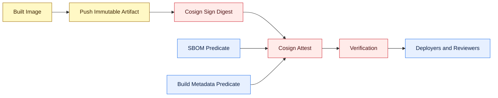

# Cosign Signing and Attestation Reference

Cosign is the selected image signing and attestation tool for this reference architecture.

For demo use, the best approach in this repository is **Cosign with a Jenkins-managed key pair** because it is easy to explain, easy to run in a self-hosted Jenkins setup, and makes the signature and attestation flow visible to other engineers. For production use, the preferred approach depends on the CI identity model:

- use **keyless OIDC** when the CI platform can mint trusted workload identity tokens
- use **KMS-backed keys** when the CI platform is self-hosted and identity federation is not mature enough

## Where Cosign Fits



Cosign belongs after the registry push because signatures and attestations should point to the immutable digest, not just a mutable tag such as `latest`.

## Why Cosign Is Chosen

Cosign is useful here because it solves two different supply chain requirements in one tool:

- sign the image digest so consumers can verify integrity and origin
- attach attestations such as SBOMs or build metadata as OCI referrers

It is a strong fit for this reference because it is:

- widely used in modern software supply chain security programs
- aligned with Sigstore patterns and ecosystem tooling
- compatible with local keys, KMS-backed keys, Kubernetes secrets, and keyless OIDC
- practical for container registries and Kubernetes-native delivery flows
- easy to explain in interviews because the model is clear: push, sign, attest, verify

## Demo-Friendly Recommendation

For this repository demo, use **Cosign with a self-managed key pair stored in Jenkins credentials**.

Why this is the best demo path:

- it works with self-hosted Jenkins without relying on external identity federation
- the setup is understandable for others reviewing the repository
- the private key stays outside Git and inside Jenkins credentials
- the public key can be published with the evidence so others can verify the signature model

## Best-Practice Recommendation

For production, the best choice depends on the CI platform and trust model.

### Option 1: Keyless OIDC

Best when:

- using GitHub Actions or another CI with strong built-in OIDC identity
- you want short-lived signing identity instead of long-lived key custody
- you want transparency-log-backed signing events and simpler key operations

Why it is strong:

- no long-lived private key distribution to CI runners
- identity is tied to the workload at signing time
- signing events can be recorded in Rekor for auditability

Tradeoff:

- requires a CI environment with usable workload identity or federated OIDC setup
- not always the easiest starting point for self-hosted Jenkins demos

### Option 2: KMS-Backed Key

Best when:

- using self-hosted Jenkins
- you need central control over signing keys
- you want stronger key custody than a file-based private key

Typical backends:

- AWS KMS
- Google Cloud KMS
- Azure Key Vault
- HashiCorp Vault or OpenBao

Why it is strong:

- private signing key material stays in managed key infrastructure
- central IAM controls access to sign operations
- easier to scale across multiple Jenkins agents and teams

Tradeoff:

- requires cloud IAM design and KMS lifecycle management
- more setup than a simple demo key pair

### Option 3: Jenkins-Managed Private Key File

Best when:

- you need a working demo quickly
- the goal is to show the signing concept, not full enterprise custody

Why it is acceptable for the demo:

- straightforward to configure
- easy for other engineers to follow in a walkthrough

Tradeoff:

- long-lived private key is still present in CI, even if protected by credentials management
- weaker enterprise posture than KMS or keyless OIDC

## Comparison Table

| Strategy | Demo friendly | Production strength | Key custody | CI fit |
|---|---|---|---|---|
| Jenkins-managed key pair | High | Medium | Jenkins credentials store | Best for self-hosted demos |
| KMS-backed key | Medium | High | External KMS or Vault | Best for self-hosted Jenkins in production |
| Keyless OIDC | Medium | High | No long-lived private key in CI | Best for CI with native workload identity |
| Kubernetes secret key | Medium | Medium | Cluster secret store | Works, but usually weaker than KMS and less portable |

## What This Repository Uses

This repository uses the following pattern when Cosign is enabled:

- push the image first
- derive the immutable digest reference
- sign the digest with Cosign
- attest the CycloneDX SBOM
- attest build metadata
- publish a verification report to the public dashboard

This is a good interview-friendly sequence because it demonstrates the difference between:

- pushing an artifact
- signing an artifact
- attaching evidence about an artifact

## What To Attest

For this repository, the best initial attestation set is:

| Attestation | Why it matters |
|---|---|
| CycloneDX SBOM | Proves what package inventory was associated with the released image |
| Build metadata predicate | Proves which build, commit, and pipeline context produced the artifact |

Later, production pipelines may also add:

- provenance attestations aligned with SLSA or in-toto models
- vulnerability scan summaries
- policy evaluation results
- deployment approval evidence

## Key Examples

### Self-managed key pair

```bash
cosign sign --key cosign.key <image-digest>
cosign attest --key cosign.key --type cyclonedx --predicate sbom.cyclonedx.json <image-digest>
```

### AWS KMS

```bash
cosign sign --key awskms:///alias/platform-cosign-signing <image-digest>
```

### Keyless OIDC

```bash
cosign sign <image-digest>
cosign attest --type cyclonedx --predicate sbom.cyclonedx.json <image-digest>
```

## Verification Model

Consumers should verify the digest before deployment.

Examples:

```bash
cosign verify --key cosign.pub <image-digest>
cosign verify-attestation --key cosign.pub --type cyclonedx <image-digest>
cosign tree <image-digest>
```

## Recommendation Summary

| Environment | Best choice |
|---|---|
| This Jenkins demo | Jenkins-managed Cosign key pair |
| Self-hosted Jenkins in production | KMS-backed Cosign key |
| GitHub Actions or strong workload-identity CI | Keyless OIDC |

## Reference Links

- [Cosign signing overview](https://docs.sigstore.dev/cosign/signing/overview/)
- [Cosign signing containers](https://docs.sigstore.dev/cosign/signing/signing_with_containers/)
- [Cosign key management overview](https://docs.sigstore.dev/cosign/key_management/overview/)
