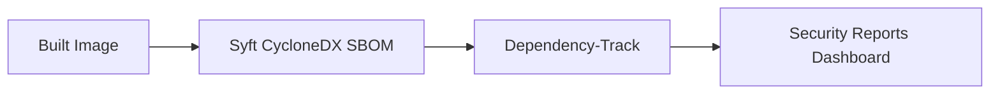

# OWASP Dependency-Track Reference

Dependency-Track is the SBOM intelligence platform in this reference architecture.

It is used after the image SBOM is generated so Jenkins can publish the CycloneDX SBOM to a central service that tracks component risk, vulnerability history, and policy compliance over time.

## Why Dependency-Track Is Used

Dependency-Track is a good fit here because it:

- ingests CycloneDX SBOMs directly
- keeps vulnerability findings tied to a project and version
- exposes API-driven integrations for CI/CD systems
- helps teams review component risk over time, not just at build time
- complements local scan tools such as Grype by storing the SBOM in a system of record

For this repository, that means Syft creates the SBOM, Jenkins uploads it to Dependency-Track, and the generated upload proof is committed into the security evidence folders.

## Where Dependency-Track Fits

The upload stage runs after SBOM generation and before downstream evidence publication, so the security dashboard can show that the SBOM was handed off to the vulnerability intelligence platform.

## What We Use In This Reference

The Jenkins pipeline uploads the generated `sbom.cyclonedx.json` file using the Dependency-Track BOM upload API.

Pipeline inputs:

| Item | Purpose |
|---|---|
| `DEPENDENCY_TRACK_URL` | Base URL of the Dependency-Track server |
| `DEPENDENCY_TRACK_API_KEY_CREDENTIALS_ID` | Jenkins secret text credential that stores the API key |
| `DEPENDENCY_TRACK_PROJECT_NAME` | Logical project name in Dependency-Track |
| `IMAGE_TAG` | Project version used for the uploaded SBOM |

For this repository, the Jenkins values are:

| Jenkins setting | Value |
|---|---|
| `DEPENDENCY_TRACK_URL` | `http://dtrack-dependency-track-api-server.dependency-track.svc.cluster.local:8080` |
| `DEPENDENCY_TRACK_API_KEY_CREDENTIALS_ID` | `owasp_dependency_track` |
| `DEPENDENCY_TRACK_PROJECT_NAME` | `platform-engineering-reference-architectures` |

The pipeline writes evidence files to `security-reports/` and republishes them under `docs/security-reports/` so they are visible in the dashboard and in the Git history.

## How To Install And Integrate With Jenkins

1. Deploy Dependency-Track in your environment using the official OWASP project deployment guidance.
2. Create or identify the project that will receive SBOM uploads.
3. Generate an API key for a service account with permission to upload BOMs.
4. Add that API key to Jenkins as a secret text credential named `owasp_dependency_track`.
5. Set `DEPENDENCY_TRACK_URL` in the Jenkins pipeline environment to `http://dtrack-dependency-track-api-server.dependency-track.svc.cluster.local:8080`.
6. Ensure the Jenkinsfile publishes the CycloneDX SBOM with `autoCreate=true`.
7. Confirm that the generated `dependency-track-report.html` and `dependency-track-report.json` files appear in `docs/security-reports/` after the build.

## What The Jenkins Stage Does

The pipeline stage:

- checks for the presence of `sbom.cyclonedx.json`
- uploads the SBOM to Dependency-Track using the BOM API
- records the HTTP status and response payload as evidence
- creates a simple HTML report for the security dashboard

## Troubleshooting

| Symptom | Likely cause |
|---|---|
| Upload is skipped | `DEPENDENCY_TRACK_URL` is not configured yet |
| Upload fails with 401 or 403 | Jenkins credential is missing or the API key does not have BOM upload permissions |
| Project is created repeatedly | The configured project name or version is changing on every build |
| No report appears in the dashboard | The pipeline has not been run after the integration was added |

## Recommended Practice

Use Dependency-Track as the SBOM system of record, then keep lightweight scan tools such as Grype and Trivy in the build itself for fast gates.

That gives you both:

- immediate build-time enforcement
- longer-lived SBOM intelligence and historical reporting