# SonarQube SAST Reference

SonarQube is the selected SAST and code quality platform for this reference architecture.

For demo use, this reference uses **SonarQube Community Build** because it is free, self-hosted, and enough to show the SAST workflow inside a Kubernetes-based Jenkins environment. For enterprise use, teams should evaluate a licensed SonarQube plan because the value shifts from a demo scan to organization-wide governance, auditability, support, and integration depth.

## Where SonarQube Fits

```mermaid
flowchart LR
    commit[Developer Commit]
    test[Unit Tests]
    coverage[JaCoCo Coverage]
    sonar[SonarQube Analysis]
    quality[Quality Gate]
    package[Package App]
    image[Build Image]
    registry[Registry Push]

    commit --> test --> coverage --> sonar --> quality --> package --> image --> registry

    classDef source fill:#e7f0ff,stroke:#1f6feb,color:#0b1f44;
    classDef quality fill:#ecfdf3,stroke:#1a7f37,color:#062b16;
    classDef security fill:#ffebe9,stroke:#cf222e,color:#4d1113;
    classDef artifact fill:#fff8c5,stroke:#9a6700,color:#3b2300;

    class commit source;
    class test,coverage quality;
    class sonar,quality security;
    class package,image,registry artifact;
```



SonarQube should run after tests and coverage are generated, and before packaging or image promotion. That placement lets the pipeline evaluate source risk before producing and publishing deployable artifacts.

## Why SonarQube Is Chosen

SonarQube is useful here because it combines several controls in one platform:

- static analysis for bugs, vulnerabilities, and security hotspots
- quality gates that can block the pipeline
- code coverage import from JaCoCo
- technical debt and maintainability metrics
- Java, JavaScript, TypeScript, Python, YAML, Dockerfile, Kubernetes, Terraform, and other language support depending on edition
- Jenkins integration through the SonarQube Scanner plugin and Maven scanner
- historical project trends, issue workflow, and dashboards

For this repository, SonarQube is the right SAST reference because it is widely adopted, easy to explain, works well with Maven and Jenkins, and gives engineers a single UI for code quality and source-level security review.

## Demo Choice

| Decision | Value |
|---|---|
| Product | SonarQube Community Build |
| License cost | Free |
| Deployment model | Self-hosted on Kubernetes |
| Why this version | Good for demos, labs, local validation, and showing the SAST control pattern |
| Pipeline status | Placeholder exists today; activation requires SonarQube URL and token |

Use Community Build for this repository demo because it avoids license friction and still shows the important architecture pattern: run SAST before artifact promotion and use the result as evidence.

## Licensed Choice

SonarSource pricing changes over time, so the exact quote must be verified before purchase. As of the current public pricing page, SonarQube paid plans include:

| Plan | Public pricing signal | Notes |
|---|---:|---|
| Free / Community path | Free | Good for demos, open inspection, and basic self-hosted evaluation |
| Team | Starts at `$34/month` for up to `100k` private lines of code | Public pricing lists Team as the entry paid plan |
| Enterprise | Custom annual pricing | Intended for larger organizations, governance, scale, advanced security, and enterprise controls |

Self-hosted SonarQube Server licensing is commonly evaluated by edition, feature set, and analyzed lines of code. Treat the numbers above as a public pricing signal, not a procurement quote.

## Why Choose A Licensed Plan

Choose a licensed SonarQube plan when the requirement moves beyond a demo and into team or enterprise governance.

Licensed plans are normally considered for:

- private codebase scale based on analyzed lines of code
- pull request and branch governance across teams
- security reporting and audit evidence
- SSO, SCIM, identity controls, and enterprise access management
- portfolio and organization-level views
- advanced security capabilities such as deeper SAST, SCA, dependency risk, SBOM-related features, or compliance reporting where available
- commercial support, SLA expectations, and upgrade confidence

For production programs, the licensed value is not only the scanner. It is the governance surface around the scanner.

## Kubernetes Installation For Demo

These steps install SonarQube Community Build into a Kubernetes cluster using Helm. This is intentionally suitable for a demo or lab environment.

### 1. Create Namespace

```bash
kubectl create namespace sonarqube
```

### 2. Add Helm Repository

```bash
helm repo add sonarqube https://SonarSource.github.io/helm-chart-sonarqube
helm repo update
```

### 3. Install SonarQube Community Build

```bash
helm upgrade --install sonarqube sonarqube/sonarqube \
  --namespace sonarqube \
  --set community.enabled=true \
  --set service.type=NodePort \
  --set service.nodePort=30090 \
  --set persistence.enabled=true \
  --set persistence.size=10Gi
```

If the chart version used in your environment does not support `community.enabled=true`, check the chart values and use the community or default image option provided by that chart version.

### 4. Wait For The Pod

```bash
kubectl get pods -n sonarqube -w
```

Wait until the SonarQube pod is `Running` and ready.

### 5. Access The UI

```bash
kubectl get nodes -o wide
```

Open:

```text
http://<NODE-IP>:30090
```

Default login for a fresh demo instance is normally:

| Field | Value |
|---|---|
| Username | `admin` |
| Password | `admin` |

Change the password after first login.

### 6. Create A Jenkins Token

In SonarQube:

1. Open **My Account -> Security**.
2. Generate a token for Jenkins.
3. Store the token in Jenkins credentials as a secret text credential.

Recommended Jenkins credential ID:

```text
sonarqube-token
```

### 7. Configure Jenkins

In Jenkins:

1. Install the **SonarQube Scanner** plugin.
2. Go to **Manage Jenkins -> System -> SonarQube servers**.
3. Add the SonarQube server URL.
4. Select the `sonarqube-token` credential.
5. Use the same server name in the Jenkinsfile when the placeholder stage is enabled.

## Maven Analysis Pattern

For this Java sample application, the Maven scanner is the simplest path:

```bash
mvn -B verify sonar:sonar \
  -Dsonar.projectKey=platform-reference-sample-app \
  -Dsonar.projectName="Platform Reference Sample App" \
  -Dsonar.host.url=http://sonarqube.sonarqube.svc.cluster.local:9000 \
  -Dsonar.token=$SONAR_TOKEN \
  -Dsonar.coverage.jacoco.xmlReportPaths=target/site/jacoco/jacoco.xml
```

In Jenkins, the token should come from Jenkins credentials and should never be committed to Git.

## Alternatives For SAST

| Tool | Open source / free path | Licensed path | Strengths | Tradeoffs |
|---|---|---|---|---|
| SonarQube | Community Build / free paths available | Team and Enterprise plans | Strong code quality plus SAST, quality gates, coverage import, dashboards, Jenkins fit | Licensed features needed for broader enterprise governance |
| Semgrep | Open source CLI available | Semgrep paid platform | Fast rules, strong developer workflow, custom rule authoring | Requires rule/platform maturity for enterprise governance |
| CodeQL | Free for public GitHub repos; available through GitHub code scanning | GitHub Advanced Security for private enterprise use | Deep semantic analysis, strong GitHub integration | Best fit when GitHub is the main DevSecOps platform |
| Snyk Code | Free tier available | Paid Snyk plans | Developer-friendly SaaS, good PR workflow | SaaS dependency and pricing by plan/team |
| Checkmarx | Commercial | Commercial | Enterprise AppSec depth, policy and reporting | Heavier platform, licensed procurement |
| Veracode | Commercial | Commercial | Mature enterprise AppSec program support | SaaS workflow and commercial cost |
| Fortify | Commercial | Commercial | Deep enterprise SAST, long AppSec history | Operational weight and licensing complexity |

## Tool Selection Guidance

| Scenario | Recommended choice |
|---|---|
| Demo on a local or lab Kubernetes cluster | SonarQube Community Build |
| Jenkins-centered Java pipeline with coverage and quality gates | SonarQube |
| GitHub-native code scanning program | CodeQL / GitHub Advanced Security |
| Lightweight custom rule scanning | Semgrep |
| SaaS developer security program | Snyk Code, Veracode, or Checkmarx depending on enterprise preference |
| Regulated enterprise with audit, SSO, reporting, and support needs | Licensed SonarQube, Checkmarx, Veracode, or Fortify evaluation |

## Reference Links

- [SonarQube pricing](https://www.sonarsource.com/plans-and-pricing/)
- [SonarQube Kubernetes installation documentation](https://docs.sonarsource.com/sonarqube-server/server-installation/on-kubernetes-or-openshift/installation-overview.md)
- [SonarQube Jenkins integration documentation](https://docs.sonarsource.com/sonarqube-server/analyzing-source-code/ci-integration/jenkins-integration.md)
- [SonarScanner for Maven documentation](https://docs.sonarsource.com/sonarqube-server/analyzing-source-code/scanners/sonarscanner-for-maven.md)
