# Supply Chain Security Reference Architecture

This reference architecture demonstrates how to design and operate a Jenkins pipeline that builds a container image, applies quality and security controls, publishes evidence, and establishes artifact provenance.

The sample workload is a Spring Boot TODO application. The main focus is the Jenkins system around the application: stage separation, explicit gates, credential handling, evidence retention, artifact promotion, signing, and verification.

Jenkins is the implementation used here, but the control pattern is platform-neutral. The same sequence can be implemented with GitHub Actions, GitLab CI, Tekton, Azure DevOps, or another CI/CD orchestrator that supports equivalent gates and evidence handling.

[](https://github-arun-repo.github.io/platform-engineering-reference-architectures/)

## Live Pipeline Evidence

The pipeline has been executed against the sample application and the generated security reports are available for review.

**Security Dashboard:**
[https://github-arun-repo.github.io/platform-engineering-reference-architectures/](https://github-arun-repo.github.io/platform-engineering-reference-architectures/)

**Generated Reports:**
[Browse the security report files](https://github.com/Github-Arun-Repo/platform-engineering-reference-architectures/tree/main/supply-chain-security-ref/security-reports)

## Architecture Principles

1. **Separate analysis from enforcement.** A scan produces evidence; the following gate decides whether the pipeline may continue.
2. **Fail early.** Source, test, coverage, dependency, and code-quality failures are evaluated before an image is promoted.
3. **Promote an immutable artifact.** The pipeline captures the pushed image digest and uses that digest for signing and attestations.
4. **Keep evidence reviewable.** Reports are retained in Jenkins and published to the repository dashboard.
5. **Use least-privilege credentials.** Git, Docker Hub, SonarQube, Dependency-Track, and Cosign credentials are supplied by Jenkins only to stages that need them.
6. **Make optional behavior explicit.** Cosign stages run when `ENABLE_COSIGN=true`, which is the default.

## Architecture Overview

The pipeline turns a developer commit into a deployable, trusted container artifact. Deployment is outside the current pipeline scope; the final output is a registry image whose quality checks, security decisions, signature, attestations, and supporting evidence can be reviewed independently.

```mermaid
flowchart LR
    developer[Developer Commit]
    ci[CI Pipeline]
    early[Early Security Checks]
    quality[Build and Test]
    analysis[SCA and SAST]
    container[Container Build]
    sbom[SBOM]
    assessment[Vulnerability Assessment]
    gates[Security and Quality Gates]
    registry[Artifact Registry]
    provenance[Signing and Attestation]
    trusted[Deployable Trusted Artifact]

    developer --> ci --> early --> quality --> analysis --> container --> sbom
    sbom --> assessment --> gates --> registry --> provenance --> trusted
```



## Pipeline Phases

| Phase | Purpose | Stages |
|---|---|---|
| 1. Source Validation | Retrieve trusted source and reject exposed secrets | 1–3 |
| 2. Test & Code Quality | Run tests, generate coverage, and enforce quality thresholds | 4–7 |
| 3. Application Security | Analyze dependencies and source code before packaging | 8–11 |
| 4. Build & Image Creation | Package the application and then build the container image | 12–13 |
| 5. Container Security | Generate an SBOM, scan the image, enforce policy, and publish the SBOM | 14–17 |
| 6. Evidence Publication | Retain and publish security evidence before promotion | 18–19 |
| 7. Registry Promotion & Provenance | Push, sign, attest, verify, and publish provenance evidence | 20–24 |

## End-to-End Jenkins Design

The diagram below follows the active Jenkins stages in exact execution order. Stages 21–24 are conditional and run when Cosign is enabled.

```mermaid
flowchart LR
    checkout[01 Checkout]
    secretScan[02 Repository Secret Scan]
    secretGate[03 Secret Exposure Gate]
    tests[04 Unit Test Execution]
    testGate[05 Unit Test Result Gate]
    coverage[06 Coverage Evidence Generation]
    coverageGate[07 Coverage Threshold Gate]
    sca[08 SCA Dependency Scan]
    scaGate[09 SCA Policy Gate]
    sast[10 SAST Code Analysis]
    sastGate[11 SAST Quality Gate]
    package[12 Build Application]
    image[13 Build Docker Image]
    sbom[14 Generate CycloneDX SBOM]
    imageScan[15 Container Image Scan]
    imageGate[16 Container Security Policy Gate]
    dtrack[17 Publish SBOM to Dependency-Track]
    archive[18 Archive Security Reports]
    publishReports[19 Commit Security Reports]
    push[20 Push to Registry]
    sign[21 Sign Image with Cosign]
    attest[22 Attest Image with Cosign]
    verify[23 Validate Cosign Artifacts]
    publishCosign[24 Commit Cosign Evidence]
    dashboard[Evidence Dashboard]

    checkout --> secretScan --> secretGate --> tests --> testGate --> coverage --> coverageGate
    coverageGate --> sca --> scaGate --> sast --> sastGate --> package --> image
    image --> sbom --> imageScan --> imageGate --> dtrack --> archive --> publishReports --> push
    push --> sign --> attest --> verify --> publishCosign --> dashboard
    publishReports --> dashboard

    classDef source fill:#e7f0ff,stroke:#1f6feb,color:#0b1f44;
    classDef quality fill:#ecfdf3,stroke:#1a7f37,color:#062b16;
    classDef security fill:#ffebe9,stroke:#cf222e,color:#4d1113;
    classDef artifact fill:#fff8c5,stroke:#9a6700,color:#3b2300;
    classDef evidence fill:#f6f8fa,stroke:#57606a,color:#24292f;
    classDef provenance fill:#fbefff,stroke:#8250df,color:#3b1764;

    class checkout source;
    class tests,testGate,coverage,coverageGate quality;
    class secretScan,secretGate,sca,scaGate,sast,sastGate,imageScan,imageGate security;
    class package,image,sbom,push artifact;
    class dtrack,archive,publishReports,dashboard evidence;
    class sign,attest,verify,publishCosign provenance;
```



## Active Stage Navigator

This table is a one-to-one map of the active stages in the Jenkinsfile.

| # | Jenkins stage | Phase | Tool or Jenkins feature | Result | Blocking behavior |
|---:|---|---|---|---|---|
| 1 | [Checkout](#stage-1--checkout) | Source Validation | Jenkins GitSCM | Source workspace | Blocks on checkout failure |
| 2 | [Repository Secret Scan](#stage-2--repository-secret-scan) | Source Validation | Gitleaks | JSON, HTML, and exit status | Records result for stage 3 |
| 3 | [Secret Exposure Gate](#stage-3--secret-exposure-gate) | Source Validation | Shell policy | Gate decision | Blocks on findings or scan error |
| 4 | [Unit Test Execution (JUnit)](#stage-4--unit-test-execution-junit) | Test & Code Quality | Maven Surefire and JUnit | Test XML and exit status | Records result for stage 5 |
| 5 | [Unit Test Result Gate](#stage-5--unit-test-result-gate) | Test & Code Quality | Shell policy | Gate decision | Blocks when tests fail |
| 6 | [Coverage Evidence Generation (JaCoCo)](#stage-6--coverage-evidence-generation-jacoco) | Test & Code Quality | JaCoCo | HTML and XML coverage | Records result for stage 7 |
| 7 | [Coverage Threshold Gate](#stage-7--coverage-threshold-gate) | Test & Code Quality | AWK and shell policy | Coverage percentage | Blocks below configured minimum |
| 8 | [SCA Dependency Scan (OWASP Dependency-Check)](#stage-8--sca-dependency-scan-owasp-dependency-check) | Application security | OWASP Dependency-Check | JSON and HTML SCA reports | Records result for stage 9 |
| 9 | [SCA Policy Gate (Critical/High)](#stage-9--sca-policy-gate-criticalhigh) | Application security | Shell policy | Critical and High counts | Blocks according to SCA policy |
| 10 | [SAST Code Analysis (SonarQube)](#stage-10--sast-code-analysis-sonarqube) | Application security | SonarQube | Analysis and summary reports | Blocks on analysis failure |
| 11 | [SAST Quality Gate (SonarQube)](#stage-11--sast-quality-gate-sonarqube) | Application security | `waitForQualityGate` | SonarQube gate result | Blocks on failed quality gate |
| 12 | [Build Application](#stage-12--build-application) | Build & Image Creation | Maven | Executable JAR | Blocks on packaging failure |
| 13 | [Build Docker Image](#stage-13--build-docker-image) | Build & Image Creation | Docker | Build-number and latest tags | Blocks on image build failure |
| 14 | [Generate CycloneDX SBOM with Trivy](#stage-14--generate-cyclonedx-sbom-with-trivy) | Container Security | Trivy | CycloneDX SBOM and summary | Blocks if SBOM generation fails |
| 15 | [Container Image Vulnerability Scan (Trivy)](#stage-15--container-image-vulnerability-scan-trivy) | Container Security | Trivy | JSON, HTML, status, severity counts | Records result for stage 16 |
| 16 | [Container Security Policy Gate (Trivy)](#stage-16--container-security-policy-gate-trivy) | Container Security | Shell policy | Gate decision | Blocks according to Trivy policy |
| 17 | [Publish SBOM to Dependency-Track](#stage-17--publish-sbom-to-dependency-track) | Container Security | Dependency-Track API | Upload status and response | Blocks if configured upload fails |
| 18 | [Archive Security Reports](#stage-18--archive-security-reports) | Evidence Publication | Jenkins artifacts | Build-linked report archive | Non-blocking for empty optional files |
| 19 | [Commit Security Reports](#stage-19--commit-security-reports) | Evidence Publication | Git and SSH | Reports published to Git and dashboard | Blocks on publication failure |
| 20 | [Push to Registry](#stage-20--push-to-registry) | Registry Promotion & Provenance | Docker Hub | Pushed image and immutable digest | Blocks on push or digest failure |
| 21 | [Sign Image with Cosign](#stage-21--sign-image-with-cosign) | Registry Promotion & Provenance | Cosign | Signature, public key, verification output | Conditional; blocks on verification failure |
| 22 | [Attest Image with Cosign](#stage-22--attest-image-with-cosign) | Registry Promotion & Provenance | Cosign | SBOM and build attestations | Conditional; blocks on failure |
| 23 | [Validate Cosign Artifacts in Registry](#stage-23--validate-cosign-artifacts-in-registry) | Registry Promotion & Provenance | Cosign and registry API | Referrer and registry evidence | Conditional; blocks when evidence is missing |
| 24 | [Commit Cosign Evidence](#stage-24--commit-cosign-evidence) | Registry Promotion & Provenance | Git and SSH | Provenance evidence on dashboard | Conditional; blocks on publication failure |

## Stage-by-Stage Design

---

### Phase 1 — Source Validation

#### Stage 1 — Checkout

**Purpose:** Jenkins checks out the `main` branch using GitSCM and pins the build to a specific source revision. This stage runs first so that every later stage works against the same known copy of the code. It uses a Jenkins Git credential to access the repository, and the checked-out revision becomes the identity that ties together every report, image, signature, and attestation produced later.

**Failure behavior:** If the repository cannot be reached or the credential is invalid, the checkout fails and the pipeline stops before any build work begins.

#### Stage 2 — Repository Secret Scan

**Purpose:** Gitleaks scans the checked-out repository for credentials, API keys, tokens, private keys, and other secrets that may have been committed by accident. The scan runs near the start of the pipeline so that exposed secrets are found before the application is built or a container image is created. Instead of failing inside the tool, the stage records the Gitleaks exit status so that the next stage can make a clear pass or fail decision.

**Evidence:**

- `gitleaks-report.json`
- `gitleaks-report.html`
- `gitleaks-exit-code.txt`

#### Stage 3 — Secret Exposure Gate

**Purpose:** Jenkins reads the Gitleaks exit status from the previous stage and turns it into a promotion decision. Keeping the decision in a separate gate stage makes the result easy to see in the Jenkins pipeline view and keeps the policy out of the scanning command.

**Policy:**

- exit code `0`: no secrets found; pass
- exit code `1`: secrets found; fail
- exit code greater than `1`: scan or runtime error; fail

**Why it matters:** The pipeline stops here if secrets are detected, so no test run, build, or image can use compromised source code.

---

### Phase 2 — Test & Code Quality

#### Stage 4 — Unit Test Execution (JUnit)

**Purpose:** Maven Surefire runs the Spring Boot unit tests and records the result. This stage focuses only on running the tests and collecting evidence; the pass or fail decision is made by the next stage. Separating execution from enforcement means the full set of test results is always captured, even when some tests fail.

**Evidence:** Surefire XML reports and `test-exit-code.txt`.

#### Stage 5 — Unit Test Result Gate

**Purpose:** Jenkins reads the test exit status captured in the previous stage and decides whether the pipeline can continue. This gate exists so that failing tests stop the build early, before any packaging or scanning work is done.

**Policy:** Any non-zero test status blocks the pipeline.

**Why it matters:** A functionally broken application is never packaged, scanned, or promoted.

#### Stage 6 — Coverage Evidence Generation (JaCoCo)

**Purpose:** JaCoCo turns the results of the completed test run into line and branch coverage evidence. It runs after the tests pass so that the coverage numbers reflect a working build. The XML report it produces is also the input that the next stage uses to enforce the coverage threshold.

**Evidence:** HTML report, XML report, CSV report, and session information under the JaCoCo report directory.

**Nested reference:** [Sample application and test context](./sample-application/README.md)

#### Stage 7 — Coverage Threshold Gate

**Purpose:** Jenkins reads the JaCoCo XML report, calculates the line coverage percentage, and compares it against the configured minimum. This turns coverage from a chart that is only looked at into a rule that the build must meet.

**Policy:** Coverage below `JACOCO_MIN_LINE_COVERAGE` blocks the pipeline. The current configured minimum is `70%`.

**Evidence:** `jacoco-line-coverage.txt`.

**Why it matters:** If coverage drops below the agreed level, the pipeline stops so that undertested code is not promoted.

---

### Phase 3 — Application Security

SCA and SAST are independent controls. They are not part of the unit-test gate.

- **SCA** evaluates third-party components and known dependency vulnerabilities.
- **SAST** evaluates application source code, quality, and security rules.

Each control has its own analysis stage and policy gate.

#### Stage 8 — SCA Dependency Scan (OWASP Dependency-Check)

**Purpose:** OWASP Dependency-Check performs software composition analysis (SCA) on the project's Maven dependencies and matches them against known CVEs. It runs after the quality checks but before the application is packaged, so vulnerable third-party libraries are found while it is still cheap to stop the build. This stage produces the findings; the following gate applies the policy.

**Evidence:**

- `dependency-check-report.json`
- `dependency-check-report.html`

**Nested reference:** [Dependency and SBOM intelligence design](./tools/dependency-track.md)

#### Stage 9 — SCA Policy Gate (Critical/High)

**Purpose:** Jenkins reads the Dependency-Check JSON report, counts the Critical and High findings, and decides whether the pipeline can continue. Keeping the counting and the decision in a dedicated gate makes the reason for a block easy to see.

**Policy:**

- Critical findings block when `DEPENDENCY_GATE_FAIL_ON_CRITICAL=true`.
- High findings block when `DEPENDENCY_GATE_FAIL_ON_HIGH=true`.
- A missing JSON report blocks the pipeline, because a missing report means the scan cannot be trusted.

**Evidence:** Critical and High count files.

#### Stage 10 — SAST Code Analysis (SonarQube)

**Purpose:** This stage performs static application security testing (SAST). The SonarQube Maven scanner analyzes the source code for bugs, security vulnerabilities, code smells, duplication, and maintainability problems. Jenkins first validates its SonarQube token, runs the scan, and then queries the SonarQube API to collect a summary of the results. Running SAST before the image is built means source-level problems are found before they are packaged into an artifact.

**Evidence:** A repository summary records bugs, vulnerabilities, code smells, the coverage value reported by SonarQube, duplication, lines of code, and the quality-gate status. The Jenkinsfile does not explicitly configure a JaCoCo XML import path, so SonarQube coverage depends on project or server-side scanner configuration.

**Dependencies:** SonarQube server configuration and a Jenkins-managed token.

**Nested reference:** [SonarQube SAST and quality-gate design](./tools/sonarqube-sast.md)

#### Stage 11 — SAST Quality Gate (SonarQube)

**Purpose:** SonarQube processes the analysis on the server side, so Jenkins waits for that result in a dedicated stage. Keeping the wait separate makes the time spent waiting and the reason for any failure clearly visible in the pipeline.

**Policy:** `waitForQualityGate abortPipeline: true` stops the pipeline when the configured SonarQube quality gate fails, for example when too many new vulnerabilities or bugs are introduced.

---

### Phase 4 — Build & Image Creation

#### Stage 12 — Build Application

**Purpose:** Maven compiles and packages the Spring Boot application into an executable JAR. This stage runs only after the source, test, coverage, SCA, and SAST checks have passed, so the artifact is built from code that has already cleared every earlier gate.

**Output:** The versioned application JAR under the Maven target directory.

**Failure behavior:** A compilation or packaging failure stops the pipeline.

#### Stage 13 — Build Docker Image

**Purpose:** Docker builds the deployable runtime image from the tested JAR. The image is tagged with the Jenkins build number and `latest` so it can be traced back to a specific build. This is the exact image that will be scanned, pushed, and signed later, so building it here creates a single artifact that all later stages act on.

**Tags:** Jenkins build number and `latest`.

**Failure behavior:** A failed image build stops the pipeline before any scanning or promotion.

---

### Phase 5 — Container Security

#### Stage 14 — Generate CycloneDX SBOM with Trivy

**Purpose:** Trivy inspects the container image that was just built and produces a software bill of materials (SBOM) in CycloneDX format. The SBOM is a complete list of the operating-system and application components inside the image. It is generated from the real image, not from the source tree, so it reflects exactly what will be shipped. This SBOM is later published to Dependency-Track and used as the predicate for the Cosign attestation, so the pipeline depends on it being produced correctly.

**Evidence:**

- `sbom.cyclonedx.json`
- `sbom-report.html`
- `sbom.trivy.log`
- `sbom-component-count.txt`

**Failure behavior:** A missing or failed SBOM stops the pipeline, because the later publication and attestation stages cannot run without it.

#### Stage 15 — Container Image Vulnerability Scan (Trivy)

**Purpose:** Trivy scans the final container image for known vulnerabilities in both operating-system packages and application dependencies. Because it scans the same image that will be promoted, the results reflect the actual artifact rather than just the source code. The stage records all findings and severity counts first, and the following gate applies the policy.

**Evidence:** JSON and HTML reports, scan status, a readable summary, and Critical, High, and Medium counts.

#### Stage 16 — Container Security Policy Gate (Trivy)

**Purpose:** Jenkins reads the vulnerability counts and scan health from the previous stage and decides whether the image is allowed to be published and pushed. This is the last security check before the image leaves the pipeline, so it also rechecks the earlier Gitleaks status as a defense-in-depth measure.

**Current policy:**

- any Critical vulnerability stops promotion
- High vulnerabilities only warn when `TRIVY_FAIL_ON_HIGH=false`; set it to `true` to stop the pipeline instead
- Medium vulnerabilities are report-only
- scan errors stop the pipeline when `TRIVY_BLOCK_ON_SCAN_ERROR=true`, so a broken scan is never treated as a pass

#### Stage 17 — Publish SBOM to Dependency-Track

**Purpose:** Jenkins uploads the CycloneDX SBOM to Dependency-Track using a Jenkins-managed API key. Dependency-Track keeps a central inventory of components and continuously matches them against new vulnerability data, so a component that is safe today but flagged tomorrow can still be tracked. This gives the team ongoing visibility that a one-time scan cannot provide.

**Evidence:** Upload summary, HTTP status, processing token, and API response.

**Failure behavior:** If a Dependency-Track URL is configured, a failed upload stops the pipeline. If no URL is configured, the stage records that publication was skipped instead of failing.

**Nested reference:** [Dependency-Track implementation and operational guidance](./tools/dependency-track.md)

---

### Phase 6 — Evidence Publication

#### Stage 18 — Archive Security Reports

**Purpose:** Jenkins archives the generated JSON, HTML, and text reports and links them to the build number. This keeps a copy of the evidence inside Jenkins even if a later publication or registry stage fails, which is important for audits and troubleshooting. Optional report files that are empty do not fail this stage.

**Review surfaces:** Jenkins build artifacts and HTML Publisher reports.

#### Stage 19 — Commit Security Reports

**Purpose:** Jenkins copies the latest reports and JaCoCo output into the documentation directory and commits the evidence to `main` using a Git SSH credential. Publishing the evidence before the image is pushed means a reviewer can see why a build passed without needing access to Jenkins. To avoid triggering endless rebuilds, the generated commits are marked with `[skip ci]`, and the branch is refreshed before publishing so concurrent builds do not overwrite each other.

**Published evidence:** Gitleaks, dependency, SonarQube, SBOM, Trivy, coverage, and build metadata.

**Dashboard:** [Open the live security evidence dashboard](https://github-arun-repo.github.io/platform-engineering-reference-architectures/)

---

### Phase 7 — Registry Promotion & Provenance

#### Stage 20 — Push to Registry

**Purpose:** Docker pushes the approved image tags to Docker Hub using Jenkins-managed registry credentials. When the push completes, the registry returns an immutable digest, and Jenkins saves this digest for the signing and attestation stages. Using the digest rather than the mutable `latest` tag means every later provenance step points at one exact image that cannot be swapped out.

**Evidence:** `cosign-image-ref.txt` stores the immutable digest reference returned after the push.

**Failure behavior:** A failed push, or a failure to capture the digest, stops the pipeline.

#### Stage 21 — Sign Image with Cosign

**Purpose:** Cosign signs the immutable image digest and then immediately verifies the signature to confirm it was created correctly. A signature proves that this specific image was approved by this pipeline. The Cosign private key and its password stay in Jenkins credentials and are only made available to this stage, so the signing material is never exposed to earlier build steps.

**Condition:** Runs when `ENABLE_COSIGN=true`, which is the default.

**Evidence:** Signature output, verification output, and public key.

**Failure behavior:** If the signature cannot be verified, the stage fails.

**Nested reference:** [Cosign signing and attestation design](./tools/cosign-signing.md)

#### Stage 22 — Attest Image with Cosign

**Purpose:** Cosign creates signed attestations for the image digest: one for the CycloneDX SBOM and one for a build-metadata predicate. Where a signature only proves who approved the image, an attestation makes verifiable statements about what is inside the image and how it was built. Cosign stores these attestations as registry referrers linked to the digest, so they travel with the image. The stage also verifies the attestations it creates.

**Condition:** Runs when `ENABLE_COSIGN=true`.

**Evidence:** Attestation commands, verification results, build predicate, referrer tree, and an HTML summary.

#### Stage 23 — Validate Cosign Artifacts in Registry

**Purpose:** Jenkins checks that the signature and attestation referrers are actually present and discoverable in the registry, not just created locally. This confirms that a consumer of the image, such as a cluster or another pipeline, would be able to find and verify the provenance evidence.

**Condition:** Runs when `ENABLE_COSIGN=true`.

**Evidence:** Cosign tree verification, registry tag data, and a registry validation summary.

**Failure behavior:** If the expected signature or attestation evidence is missing from the registry, the stage fails.

#### Stage 24 — Commit Cosign Evidence

**Purpose:** Jenkins publishes the final signature, verification, attestation, and registry evidence to Git and the dashboard using the Git SSH credential. This makes the provenance results visible alongside the rest of the security evidence, so a reviewer can confirm the image was signed and attested without opening Jenkins.

**Condition:** Runs when `ENABLE_COSIGN=true`.

**Failure behavior:** The required evidence files are checked before publication; missing files or a Git push failure stops the stage.

## Security Gate Summary

| Gate | Input | Default decision |
|---|---|---|
| Secret exposure | Gitleaks exit status | Fail on findings or tool error |
| Unit tests | Maven test exit status | Fail on any failed test or execution error |
| Coverage | JaCoCo XML line coverage | Fail below `70%` |
| Dependency security | OWASP Dependency-Check JSON | Fail on Critical and High findings |
| Source quality and security | SonarQube quality gate | Fail when SonarQube returns a failed gate |
| Container security | Trivy scan status and severity counts | Fail on Critical or scan error; High is configurable |
| SBOM publication | Dependency-Track API result | Fail when configured publication is unsuccessful |
| Signature verification | Cosign verification | Fail when the pushed digest cannot be verified |
| Registry provenance | Cosign referrers and registry data | Fail when expected signature or attestation evidence is missing |

## Evidence Catalog

| Evidence | Review purpose | Live report |
|---|---|---|
| Gitleaks | Secret findings and scan status | [Secret scanning report](https://github-arun-repo.github.io/platform-engineering-reference-architectures/gitleaks-report.html) |
| JaCoCo | Unit-test coverage | [Coverage report](https://github-arun-repo.github.io/platform-engineering-reference-architectures/jacoco/) |
| OWASP Dependency-Check | Dependency CVEs | [Dependency report](https://github-arun-repo.github.io/platform-engineering-reference-architectures/dependency-check-report.html) |
| SonarQube | SAST and code-quality summary | [SonarQube report](https://github-arun-repo.github.io/platform-engineering-reference-architectures/sonarqube-report.html) |
| CycloneDX | Image component inventory | [SBOM report](https://github-arun-repo.github.io/platform-engineering-reference-architectures/sbom-report.html) |
| Trivy | Final image vulnerabilities | [Container vulnerability report](https://github-arun-repo.github.io/platform-engineering-reference-architectures/trivy-report.html) |
| Dependency-Track | SBOM publication result | [Dependency-Track report](https://github-arun-repo.github.io/platform-engineering-reference-architectures/dependency-track-report.html) |
| Cosign | Signature, attestation, and verification evidence | [Cosign report](https://github-arun-repo.github.io/platform-engineering-reference-architectures/cosign-report.html) |

## Conditional and Disabled Stages

The four Cosign stages are active but conditional. They run by default because `ENABLE_COSIGN` defaults to `true`.

Two legacy stages remain hard-disabled in the Jenkinsfile:

- `Legacy Scan Docker Image (Disabled)`
- `Legacy Trivy Gate Placeholder (Disabled)`

They are excluded from the active stage table and Mermaid diagram because the implemented Trivy scan and policy-gate stages replace them.

## Nested Documentation

Use the main README for architecture and stage intent. Use the nested guides for implementation depth.

| Document | Purpose |
|---|---|
| [Jenkinsfile](./supply-chain-security-pipeline/Jenkinsfile) | Executable pipeline design and policy implementation |
| [Jenkins installation guide](./supply-chain-security-pipeline/installation-jenkins.md) | Jenkins, agent, plugin, credential, and integration setup |
| [Jenkins demonstration runbook](./supply-chain-security-pipeline/jenkins-demo-runbook.md) | Operational walkthrough and troubleshooting |
| [Tools reference](./tools/README.md) | Active security tool inventory |
| [SonarQube SAST guide](./tools/sonarqube-sast.md) | SAST placement, quality gates, editions, and alternatives |
| [Dependency-Track guide](./tools/dependency-track.md) | SCA, SBOM publication, operations, and alternatives |
| [Cosign guide](./tools/cosign-signing.md) | Signing, attestations, key management, and verification |
| [Sample application README](./sample-application/README.md) | Application, tests, build, and local execution context |

## Repository Map

```text
supply-chain-security-ref/
├── README.md
├── sample-application/
├── security-reports/
├── docs/
│   └── security-reports/
├── supply-chain-security-pipeline/
│   ├── Jenkinsfile
│   ├── pod-template.yaml
│   ├── installation-jenkins.md
│   └── jenkins-demo-runbook.md
└── tools/
    ├── README.md
    ├── sonarqube-sast.md
    ├── dependency-track.md
    └── cosign-signing.md
```

## Future Roadmap

The following capabilities are not implemented today. They are described here as possible future improvements to the reference architecture.

### Admission-controller verification

Future Kubernetes deployments could verify the Cosign signature and attestations before allowing an image to run. A tool such as Kyverno or another admission controller would enforce this policy inside the cluster, so an unsigned or unverified image would be refused at deploy time.

### Policy as Code

Security and promotion decisions could be moved into reusable, version-controlled policies instead of keeping all of the decision logic directly inside the Jenkinsfile. This would make the rules easier to review, reuse, and apply consistently across pipelines.

### GitOps deployment

After an image passes all security and provenance checks, the pipeline could update a GitOps repository with the approved image digest. Argo CD or another GitOps controller would then deploy that exact digest, keeping the deployed state in sync with Git.

### Environment promotion

The same signed image digest could be promoted through development, test, staging, and production without rebuilding the image. This ensures that the artifact tested earlier is exactly the artifact deployed later, with no risk of a different build slipping in between environments.

## Quick Links

- [Live Security Evidence Dashboard](https://github-arun-repo.github.io/platform-engineering-reference-architectures/)
- [Jenkins Pipeline](./supply-chain-security-pipeline/Jenkinsfile)
- [Jenkins Installation](./supply-chain-security-pipeline/installation-jenkins.md)
- [Jenkins Runbook](./supply-chain-security-pipeline/jenkins-demo-runbook.md)
- [Tools Reference](./tools/README.md)
- [Sample Application](./sample-application/)
- [Main Repository README](../README.md)
