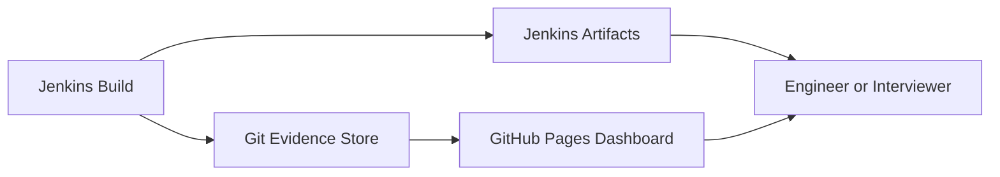

# Supply Chain Security Reference Architecture

This reference architecture demonstrates how to design and operate a Jenkins pipeline that builds a container image, applies quality and security controls, publishes evidence, and establishes artifact provenance.

The sample workload is a Spring Boot TODO application. The main focus is the Jenkins system around the application: stage separation, explicit gates, credential handling, evidence retention, artifact promotion, signing, and verification.

Jenkins is the implementation used here, but the control pattern is platform-neutral. The same sequence can be implemented with GitHub Actions, GitLab CI, Tekton, Azure DevOps, or another CI/CD orchestrator that supports equivalent gates and evidence handling.

[](https://github-arun-repo.github.io/platform-engineering-reference-architectures/)

## What This Design Demonstrates

- Kubernetes-based Jenkins agents with dedicated Maven and Docker containers
- fail-fast controls for exposed secrets and failed tests
- a minimum code coverage gate
- separate SCA and SAST analysis with separate policy gates
- application and container image creation only after pre-build controls pass
- CycloneDX SBOM generation from the built image
- container vulnerability scanning with configurable severity policy
- Dependency-Track publication for centralized SBOM intelligence
- Jenkins artifact retention and Git-based evidence publication
- image promotion only after required controls pass
- Cosign signing, attestation, registry validation, and evidence publication

## Architecture Principles

1. **Separate analysis from enforcement.** A scan produces evidence; the following gate decides whether the pipeline may continue.
2. **Fail early.** Source, test, coverage, dependency, and code-quality failures are evaluated before an image is promoted.
3. **Promote an immutable artifact.** The pipeline captures the pushed image digest and uses that digest for signing and attestations.
4. **Keep evidence reviewable.** Reports are retained in Jenkins and published to the repository dashboard.
5. **Use least-privilege credentials.** Git, Docker Hub, SonarQube, Dependency-Track, and Cosign credentials are supplied by Jenkins only to stages that need them.
6. **Make optional behavior explicit.** Cosign stages run when `ENABLE_COSIGN=true`, which is the default.

## Architecture Overview

The pipeline turns a developer commit into a deployable, trusted container artifact. Deployment is outside the current pipeline scope; the final output is a registry image whose quality checks, security decisions, signature, attestations, and supporting evidence can be reviewed independently.

```mermaid
flowchart LR
    developer[Developer Commit]
    ci[CI Pipeline]
    early[Early Security Checks]
    quality[Build and Test]
    analysis[SCA and SAST]
    container[Container Build]
    sbom[SBOM]
    assessment[Vulnerability Assessment]
    gates[Security and Quality Gates]
    registry[Artifact Registry]
    provenance[Signing and Attestation]
    trusted[Deployable Trusted Artifact]

    developer --> ci --> early --> quality --> analysis --> container --> sbom
    sbom --> assessment --> gates --> registry --> provenance --> trusted
```



## Pipeline Phases

| Phase | Purpose | Stages |
|---|---|---|
| 1. Source integrity | Retrieve trusted source and reject exposed secrets | 1–3 |
| 2. Build quality | Run tests, generate coverage, and enforce quality thresholds | 4–7 |
| 3. Application security | Analyze dependencies and source code before packaging | 8–11 |
| 4. Artifact creation | Package the application and build the container image | 12–13 |
| 5. Artifact security | Generate an SBOM, scan the image, enforce policy, and publish the SBOM | 14–17 |
| 6. Evidence publication | Retain and publish security evidence before promotion | 18–19 |
| 7. Promotion and provenance | Push, sign, attest, verify, and publish provenance evidence | 20–24 |

## End-to-End Jenkins Design

The diagram below follows the active Jenkins stages in exact execution order. Stages 21–24 are conditional and run when Cosign is enabled.

```mermaid
flowchart LR
    checkout[01 Checkout]
    secretScan[02 Repository Secret Scan]
    secretGate[03 Secret Exposure Gate]
    tests[04 Unit Test Execution]
    testGate[05 Unit Test Result Gate]
    coverage[06 Coverage Evidence Generation]
    coverageGate[07 Coverage Threshold Gate]
    sca[08 SCA Dependency Scan]
    scaGate[09 SCA Policy Gate]
    sast[10 SAST Code Analysis]
    sastGate[11 SAST Quality Gate]
    package[12 Build Application]
    image[13 Build Docker Image]
    sbom[14 Generate CycloneDX SBOM]
    imageScan[15 Container Image Scan]
    imageGate[16 Container Security Policy Gate]
    dtrack[17 Publish SBOM to Dependency-Track]
    archive[18 Archive Security Reports]
    publishReports[19 Commit Security Reports]
    push[20 Push to Registry]
    sign[21 Sign Image with Cosign]
    attest[22 Attest Image with Cosign]
    verify[23 Validate Cosign Artifacts]
    publishCosign[24 Commit Cosign Evidence]
    dashboard[Evidence Dashboard]

    checkout --> secretScan --> secretGate --> tests --> testGate --> coverage --> coverageGate
    coverageGate --> sca --> scaGate --> sast --> sastGate --> package --> image
    image --> sbom --> imageScan --> imageGate --> dtrack --> archive --> publishReports --> push
    push --> sign --> attest --> verify --> publishCosign --> dashboard
    publishReports --> dashboard

    classDef source fill:#e7f0ff,stroke:#1f6feb,color:#0b1f44;
    classDef quality fill:#ecfdf3,stroke:#1a7f37,color:#062b16;
    classDef security fill:#ffebe9,stroke:#cf222e,color:#4d1113;
    classDef artifact fill:#fff8c5,stroke:#9a6700,color:#3b2300;
    classDef evidence fill:#f6f8fa,stroke:#57606a,color:#24292f;
    classDef provenance fill:#fbefff,stroke:#8250df,color:#3b1764;

    class checkout source;
    class tests,testGate,coverage,coverageGate quality;
    class secretScan,secretGate,sca,scaGate,sast,sastGate,imageScan,imageGate security;
    class package,image,sbom,push artifact;
    class dtrack,archive,publishReports,dashboard evidence;
    class sign,attest,verify,publishCosign provenance;
```



## Active Stage Navigator

This table is a one-to-one map of the active stages in the Jenkinsfile.

| # | Jenkins stage | Phase | Tool or Jenkins feature | Result | Blocking behavior |
|---:|---|---|---|---|---|
| 1 | [Checkout](#1-checkout) | Source integrity | Jenkins GitSCM | Source workspace | Blocks on checkout failure |
| 2 | [Repository Secret Scan](#2-repository-secret-scan) | Source integrity | Gitleaks | JSON, HTML, and exit status | Records result for stage 3 |
| 3 | [Secret Exposure Gate](#3-secret-exposure-gate) | Source integrity | Shell policy | Gate decision | Blocks on findings or scan error |
| 4 | [Unit Test Execution (JUnit)](#4-unit-test-execution-junit) | Build quality | Maven Surefire and JUnit | Test XML and exit status | Records result for stage 5 |
| 5 | [Unit Test Result Gate](#5-unit-test-result-gate) | Build quality | Shell policy | Gate decision | Blocks when tests fail |
| 6 | [Coverage Evidence Generation (JaCoCo)](#6-coverage-evidence-generation-jacoco) | Build quality | JaCoCo | HTML and XML coverage | Records result for stage 7 |
| 7 | [Coverage Threshold Gate](#7-coverage-threshold-gate) | Build quality | AWK and shell policy | Coverage percentage | Blocks below configured minimum |
| 8 | [SCA Dependency Scan (OWASP Dependency-Check)](#8-sca-dependency-scan-owasp-dependency-check) | Application security | OWASP Dependency-Check | JSON and HTML SCA reports | Records result for stage 9 |
| 9 | [SCA Policy Gate (Critical/High)](#9-sca-policy-gate-criticalhigh) | Application security | Shell policy | Critical and High counts | Blocks according to SCA policy |
| 10 | [SAST Code Analysis (SonarQube)](#10-sast-code-analysis-sonarqube) | Application security | SonarQube | Analysis and summary reports | Blocks on analysis failure |
| 11 | [SAST Quality Gate (SonarQube)](#11-sast-quality-gate-sonarqube) | Application security | `waitForQualityGate` | SonarQube gate result | Blocks on failed quality gate |
| 12 | [Build Application](#12-build-application) | Artifact creation | Maven | Executable JAR | Blocks on packaging failure |
| 13 | [Build Docker Image](#13-build-docker-image) | Artifact creation | Docker | Build-number and latest tags | Blocks on image build failure |
| 14 | [Generate CycloneDX SBOM with Trivy](#14-generate-cyclonedx-sbom-with-trivy) | Artifact security | Trivy | CycloneDX SBOM and summary | Blocks if SBOM generation fails |
| 15 | [Container Image Vulnerability Scan (Trivy)](#15-container-image-vulnerability-scan-trivy) | Artifact security | Trivy | JSON, HTML, status, severity counts | Records result for stage 16 |
| 16 | [Container Security Policy Gate (Trivy)](#16-container-security-policy-gate-trivy) | Artifact security | Shell policy | Gate decision | Blocks according to Trivy policy |
| 17 | [Publish SBOM to Dependency-Track](#17-publish-sbom-to-dependency-track) | Artifact security | Dependency-Track API | Upload status and response | Blocks if configured upload fails |
| 18 | [Archive Security Reports](#18-archive-security-reports) | Evidence publication | Jenkins artifacts | Build-linked report archive | Non-blocking for empty optional files |
| 19 | [Commit Security Reports](#19-commit-security-reports) | Evidence publication | Git and SSH | Reports published to Git and dashboard | Blocks on publication failure |
| 20 | [Push to Registry](#20-push-to-registry) | Promotion | Docker Hub | Pushed image and immutable digest | Blocks on push or digest failure |
| 21 | [Sign Image with Cosign](#21-sign-image-with-cosign) | Provenance | Cosign | Signature, public key, verification output | Conditional; blocks on verification failure |
| 22 | [Attest Image with Cosign](#22-attest-image-with-cosign) | Provenance | Cosign | SBOM and build attestations | Conditional; blocks on failure |
| 23 | [Validate Cosign Artifacts in Registry](#23-validate-cosign-artifacts-in-registry) | Provenance | Cosign and registry API | Referrer and registry evidence | Conditional; blocks when evidence is missing |
| 24 | [Commit Cosign Evidence](#24-commit-cosign-evidence) | Evidence publication | Git and SSH | Provenance evidence on dashboard | Conditional; blocks on publication failure |

## Stage-by-Stage Design

### Phase 1 — Source Integrity

### 1. Checkout

**Purpose:** Jenkins checks out the `main` branch with GitSCM and pins the build to a source revision.

**Why it is separate:** Every report, image, signature, and attestation must be traceable to the source used by the build.

**Dependencies:** Repository URL and Jenkins Git credentials.

**Failure behavior:** SCM or credential errors stop the pipeline.

### 2. Repository Secret Scan

**Purpose:** Gitleaks scans the repository for committed credentials, API keys, tokens, and private keys.

**Evidence:**

- `gitleaks-report.json`
- `gitleaks-report.html`
- `gitleaks-exit-code.txt`

**Design decision:** The scan records its result instead of hiding policy inside the tool command. This allows the next stage to provide a clear gate decision.

### 3. Secret Exposure Gate

**Purpose:** Jenkins evaluates the Gitleaks exit status.

**Policy:**

- exit code `0`: pass
- exit code `1`: secrets found; fail
- exit code greater than `1`: scan or runtime error; fail

**Why it matters:** The pipeline stops before tests, builds, or images consume compromised source.

### Phase 2 — Build Quality

### 4. Unit Test Execution (JUnit)

**Purpose:** Maven Surefire runs the Spring Boot unit tests.

**Evidence:** Surefire XML reports and `test-exit-code.txt`.

**Design decision:** Test execution and test enforcement are separate. The execution stage captures complete test evidence; the next stage makes the release decision.

### 5. Unit Test Result Gate

**Purpose:** Jenkins evaluates the test exit status.

**Policy:** Any non-zero test status blocks the pipeline.

**Why it matters:** A functionally broken application is not packaged, scanned, or promoted.

### 6. Coverage Evidence Generation (JaCoCo)

**Purpose:** JaCoCo creates line and branch coverage evidence from the completed test run.

**Evidence:** HTML report, XML report, CSV report, and session information under the JaCoCo report directory.

**Nested reference:** [Sample application and test context](./sample-application/README.md)

### 7. Coverage Threshold Gate

**Purpose:** Jenkins reads the JaCoCo XML report and calculates line coverage.

**Policy:** Coverage below `JACOCO_MIN_LINE_COVERAGE` blocks the pipeline. The current configured minimum is `70%`.

**Evidence:** `jacoco-line-coverage.txt`.

**Why it matters:** The threshold turns coverage from an informational chart into an enforceable engineering standard.

### Phase 3 — Application Security

SCA and SAST are independent controls. They are not part of the unit-test gate.

- **SCA** evaluates third-party components and known dependency vulnerabilities.
- **SAST** evaluates application source code, quality, and security rules.

Each control has its own analysis stage and policy gate.

### 8. SCA Dependency Scan (OWASP Dependency-Check)

**Purpose:** OWASP Dependency-Check analyzes Maven dependencies for known CVEs before the application is packaged.

**Evidence:**

- `dependency-check-report.json`
- `dependency-check-report.html`

**Design decision:** The scan is positioned after quality validation but before artifact creation, so vulnerable dependencies can block promotion early.

**Nested reference:** [Dependency and SBOM intelligence design](./tools/dependency-track.md)

### 9. SCA Policy Gate (Critical/High)

**Purpose:** Jenkins parses the Dependency-Check JSON report and counts Critical and High findings.

**Policy:**

- Critical findings block when `DEPENDENCY_GATE_FAIL_ON_CRITICAL=true`.
- High findings block when `DEPENDENCY_GATE_FAIL_ON_HIGH=true`.
- A missing JSON report blocks the pipeline.

**Evidence:** Critical and High count files.

### 10. SAST Code Analysis (SonarQube)

**Purpose:** The SonarQube Maven scanner analyzes source code for bugs, vulnerabilities, code smells, duplication, and maintainability concerns. The stage validates its Jenkins-managed token before analysis and then queries the SonarQube API for summary metrics.

**Evidence:** A repository summary records bugs, vulnerabilities, code smells, the coverage value reported by SonarQube, duplication, lines of code, and quality-gate status. The Jenkinsfile does not explicitly configure a JaCoCo XML import path, so SonarQube coverage depends on project or server-side scanner configuration.

**Dependencies:** SonarQube server configuration and a Jenkins-managed token.

**Nested reference:** [SonarQube SAST and quality-gate design](./tools/sonarqube-sast.md)

### 11. SAST Quality Gate (SonarQube)

**Purpose:** Jenkins waits for SonarQube to finish server-side processing.

**Policy:** `waitForQualityGate abortPipeline: true` stops the pipeline when the configured SonarQube quality gate fails.

**Design decision:** The asynchronous quality gate is a dedicated stage, which makes wait time and failure ownership visible in Jenkins.

### Phase 4 — Artifact Creation

### 12. Build Application

**Purpose:** Maven packages the Spring Boot application into an executable JAR.

**Output:** The versioned application JAR under the Maven target directory.

**Failure behavior:** Compilation or packaging failure stops the pipeline.

### 13. Build Docker Image

**Purpose:** Docker builds the deployable runtime image from the tested JAR.

**Tags:** Jenkins build number and `latest`.

**Design decision:** The image is built only after source, test, coverage, SCA, and SAST gates pass.

### Phase 5 — Artifact Security

### 14. Generate CycloneDX SBOM with Trivy

**Purpose:** Trivy inspects the built image and produces a CycloneDX software bill of materials.

**Evidence:**

- `sbom.cyclonedx.json`
- `sbom-report.html`
- `sbom.trivy.log`
- `sbom-component-count.txt`

**Failure behavior:** A missing or failed SBOM blocks the pipeline because later publication and attestation depend on it.

### 15. Container Image Vulnerability Scan (Trivy)

**Purpose:** Trivy scans the final container image for known vulnerabilities in operating-system and application packages.

**Evidence:** JSON and HTML reports, scan status, a readable summary, and Critical, High, and Medium counts.

**Design decision:** The scanner records findings first; policy is applied by the following stage.

### 16. Container Security Policy Gate (Trivy)

**Purpose:** Jenkins evaluates image vulnerability counts and scan health before publication and push.

**Current policy:**

- any Critical vulnerability blocks promotion
- High vulnerabilities warn when `TRIVY_FAIL_ON_HIGH=false`; set it to `true` to block
- Medium vulnerabilities are report-only
- scan errors block when `TRIVY_BLOCK_ON_SCAN_ERROR=true`

**Defense in depth:** The stage also rechecks the Gitleaks status before promotion.

### 17. Publish SBOM to Dependency-Track

**Purpose:** Jenkins uploads the generated CycloneDX SBOM to Dependency-Track for centralized component inventory and vulnerability intelligence.

**Evidence:** Upload summary, HTTP status, processing token, and API response.

**Failure behavior:** If a Dependency-Track URL is configured, an unsuccessful upload blocks the pipeline. If no URL is configured, the stage records that publication was skipped.

**Nested reference:** [Dependency-Track implementation and operational guidance](./tools/dependency-track.md)

### Phase 6 — Evidence Publication

### 18. Archive Security Reports

**Purpose:** Jenkins archives generated JSON, HTML, and text reports against the build number.

**Why it matters:** Jenkins artifacts preserve evidence even if a later publication or registry stage fails.

**Review surfaces:** Jenkins build artifacts and HTML Publisher reports.

### 19. Commit Security Reports

**Purpose:** Jenkins copies the latest reports and JaCoCo output into the documentation directory and commits the evidence to `main`.

**Published evidence:** Gitleaks, dependency, SonarQube, SBOM, Trivy, coverage, and build metadata.

**Design decision:** Security evidence is published before registry promotion. Reviewers can inspect why a build passed without requiring Jenkins access.

**Dashboard:** [Open the live security evidence dashboard](https://github-arun-repo.github.io/platform-engineering-reference-architectures/)

### Phase 7 — Promotion and Provenance

### 20. Push to Registry

**Purpose:** Docker pushes the approved image tags to Docker Hub.

**Evidence:** `cosign-image-ref.txt` stores the immutable digest reference returned after push.

**Failure behavior:** Push failure or failure to capture the digest stops the pipeline.

**Design decision:** All signing and attestation operations use the digest, not the mutable tag.

### 21. Sign Image with Cosign

**Purpose:** Cosign signs the immutable image digest and immediately verifies the signature.

**Condition:** Runs when `ENABLE_COSIGN=true`.

**Evidence:** Signature output, verification output, and public key.

**Credential design:** The private key and password remain in Jenkins credentials and are exposed only to this stage.

**Nested reference:** [Cosign signing and attestation design](./tools/cosign-signing.md)

### 22. Attest Image with Cosign

**Purpose:** Cosign creates attestations for the CycloneDX SBOM and build metadata predicate.

**Condition:** Runs when `ENABLE_COSIGN=true`.

**Evidence:** Attestation commands, verification results, build predicate, referrer tree, and an HTML summary.

**Why it matters:** A signature proves who approved a digest. An attestation provides verifiable statements about what is inside the image and how it was built.

### 23. Validate Cosign Artifacts in Registry

**Purpose:** Jenkins verifies that signature and attestation referrers are discoverable in the registry.

**Condition:** Runs when `ENABLE_COSIGN=true`.

**Evidence:** Cosign tree verification, registry tag data, and registry validation summary.

**Failure behavior:** Missing signature or attestation evidence blocks successful completion.

### 24. Commit Cosign Evidence

**Purpose:** Jenkins publishes the final signature, verification, attestation, and registry evidence to Git and the dashboard.

**Condition:** Runs when `ENABLE_COSIGN=true`.

**Failure behavior:** Required evidence files are checked before publication; missing files or Git push failures stop the stage.

## Security Gate Summary

| Gate | Input | Default decision |
|---|---|---|
| Secret exposure | Gitleaks exit status | Fail on findings or tool error |
| Unit tests | Maven test exit status | Fail on any failed test or execution error |
| Coverage | JaCoCo XML line coverage | Fail below `70%` |
| Dependency security | OWASP Dependency-Check JSON | Fail on Critical and High findings |
| Source quality and security | SonarQube quality gate | Fail when SonarQube returns a failed gate |
| Container security | Trivy scan status and severity counts | Fail on Critical or scan error; High is configurable |
| SBOM publication | Dependency-Track API result | Fail when configured publication is unsuccessful |
| Signature verification | Cosign verification | Fail when the pushed digest cannot be verified |
| Registry provenance | Cosign referrers and registry data | Fail when expected signature or attestation evidence is missing |

## Evidence Catalog

| Evidence | Review purpose | Live report |
|---|---|---|
| Gitleaks | Secret findings and scan status | [Secret scanning report](https://github-arun-repo.github.io/platform-engineering-reference-architectures/gitleaks-report.html) |
| JaCoCo | Unit-test coverage | [Coverage report](https://github-arun-repo.github.io/platform-engineering-reference-architectures/jacoco/) |
| OWASP Dependency-Check | Dependency CVEs | [Dependency report](https://github-arun-repo.github.io/platform-engineering-reference-architectures/dependency-check-report.html) |
| SonarQube | SAST and code-quality summary | [SonarQube report](https://github-arun-repo.github.io/platform-engineering-reference-architectures/sonarqube-report.html) |
| CycloneDX | Image component inventory | [SBOM report](https://github-arun-repo.github.io/platform-engineering-reference-architectures/sbom-report.html) |
| Trivy | Final image vulnerabilities | [Container vulnerability report](https://github-arun-repo.github.io/platform-engineering-reference-architectures/trivy-report.html) |
| Dependency-Track | SBOM publication result | [Dependency-Track report](https://github-arun-repo.github.io/platform-engineering-reference-architectures/dependency-track-report.html) |
| Cosign | Signature, attestation, and verification evidence | [Cosign report](https://github-arun-repo.github.io/platform-engineering-reference-architectures/cosign-report.html) |

## Jenkins System Design

### Kubernetes Agent Model

The pipeline runs on a Kubernetes Jenkins agent. The pod template separates responsibilities:

- the **Maven container** runs Java builds, shell policies, API calls, and Git publication
- the **Docker container** builds and scans images through the Docker daemon

This design keeps build dependencies predictable and makes individual execution environments easier to maintain.

### Credential Boundaries

| Credential | Used for |
|---|---|
| Jenkins Git credential | Source checkout |
| Git SSH private key | Security and Cosign evidence commits |
| Docker Hub username/password | Image push and registry validation |
| SonarQube token | Analysis and metric retrieval |
| Dependency-Track API key | CycloneDX upload |
| Cosign private key and password | Image signing and attestations |

Credentials are injected with Jenkins credential bindings. They are not stored in the Jenkinsfile or application repository.

### SBOM and OCI Evidence Handling

The implemented pipeline generates a CycloneDX SBOM, publishes it to Dependency-Track, and uses it as a Cosign attestation predicate. Cosign stores the signed attestation as registry referrer evidence associated with the immutable image digest, and the registry validation stage confirms that signature and attestation references are discoverable.

There is no separate ORAS-based SBOM attachment stage in the current Jenkinsfile. A standalone OCI SBOM attachment and a pre-build Trivy filesystem scan are architectural extensions, not implemented stages, and are therefore excluded from the active navigator and detailed stage sequence.

### Evidence Publication Model



This provides two evidence paths:

1. build-specific artifacts in Jenkins for operations and audits
2. a public dashboard for architecture reviews and demonstrations

### Concurrency and Report Commits

Report publication creates commits on `main`. The pipeline fetches the latest branch state before publishing and marks generated commits with `[skip ci]` to avoid unnecessary rebuild loops. Concurrent builds are not allowed to abort an in-flight report publication.

### Timeouts and Retention

- the pipeline has a global 180-minute timeout
- tool stages use narrower timeouts where appropriate
- Jenkins retains the latest 15 builds
- HTML and machine-readable reports are archived for review and automation

## Conditional and Disabled Stages

The four Cosign stages are active but conditional. They run by default because `ENABLE_COSIGN` defaults to `true`.

Two legacy stages remain hard-disabled in the Jenkinsfile:

- `Legacy Scan Docker Image (Disabled)`
- `Legacy Trivy Gate Placeholder (Disabled)`

They are excluded from the active stage table and Mermaid diagram because the implemented Trivy scan and policy-gate stages replace them.

## Implementation Boundaries

The current Jenkins implementation intentionally ends with a verified registry artifact. Kubernetes deployment, GitOps manifest updates, admission-controller enforcement, a separate Trivy filesystem scan, and standalone ORAS SBOM attachment are not active stages. They are suitable follow-on controls, but the README does not present them as implemented behavior.

## Nested Documentation

Use the main README for architecture and stage intent. Use the nested guides for implementation depth.

| Document | Purpose |
|---|---|
| [Jenkinsfile](./supply-chain-security-pipeline/Jenkinsfile) | Executable pipeline design and policy implementation |
| [Jenkins installation guide](./supply-chain-security-pipeline/installation-jenkins.md) | Jenkins, agent, plugin, credential, and integration setup |
| [Jenkins demonstration runbook](./supply-chain-security-pipeline/jenkins-demo-runbook.md) | Operational walkthrough and troubleshooting |
| [Tools reference](./tools/README.md) | Active security tool inventory |
| [SonarQube SAST guide](./tools/sonarqube-sast.md) | SAST placement, quality gates, editions, and alternatives |
| [Dependency-Track guide](./tools/dependency-track.md) | SCA, SBOM publication, operations, and alternatives |
| [Cosign guide](./tools/cosign-signing.md) | Signing, attestations, key management, and verification |
| [Sample application README](./sample-application/README.md) | Application, tests, build, and local execution context |

## Repository Map

```text
supply-chain-security-ref/
├── README.md
├── sample-application/
├── security-reports/
├── docs/
│   └── security-reports/
├── supply-chain-security-pipeline/
│   ├── Jenkinsfile
│   ├── pod-template.yaml
│   ├── installation-jenkins.md
│   └── jenkins-demo-runbook.md
└── tools/
    ├── README.md
    ├── sonarqube-sast.md
    ├── dependency-track.md
    └── cosign-signing.md
```

## Interview Discussion Points

This design shows the following Jenkins engineering decisions:

- Kubernetes agents provide repeatable and isolated build environments.
- Analysis and gate stages are separated for clear diagnostics and policy ownership.
- Quality and application-security controls run before artifact creation.
- Container controls evaluate the exact image that will be promoted.
- Promotion happens only after required evidence is generated and published.
- The immutable digest becomes the identity for signing and attestations.
- Jenkins credentials are scoped to the stages that need them.
- Evidence is available both inside Jenkins and through a public review dashboard.
- Conditional provenance stages support environments where signing is optional, while defaulting to the secure path.

## Roadmap

- admission-controller verification of signatures and attestations
- policy-as-code for promotion decisions
- GitOps manifest updates after successful provenance verification
- environment-specific promotion without rebuilding the image
- registry-native evidence discovery and retention policy
- license compliance reporting

## Quick Links

- [Live Security Evidence Dashboard](https://github-arun-repo.github.io/platform-engineering-reference-architectures/)
- [Jenkins Pipeline](./supply-chain-security-pipeline/Jenkinsfile)
- [Jenkins Installation](./supply-chain-security-pipeline/installation-jenkins.md)
- [Jenkins Runbook](./supply-chain-security-pipeline/jenkins-demo-runbook.md)
- [Tools Reference](./tools/README.md)
- [Sample Application](./sample-application/)
- [Main Repository README](../README.md)
